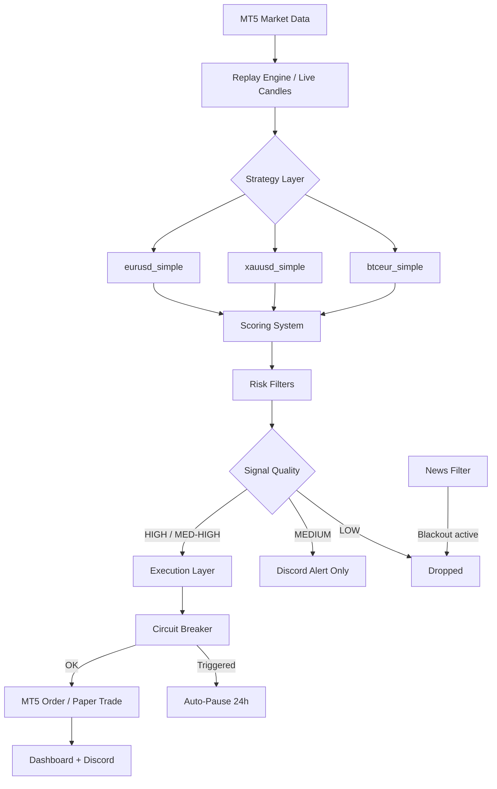
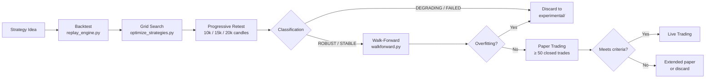

<div align="center">

# BOT-MT5

**Quantitative Trading Research Framework**

Backtesting · Optimization · Paper Trading · MT5 Execution · Discord Integration


</div>

---

## What is this?

BOT-MT5 is a personal quantitative research framework built around MetaTrader 5. It combines a strategy engine, a full backtesting pipeline, and a Discord-controlled paper trading system into a single modular codebase.

The goal is not to chase high backtest numbers. It is to find strategies that survive when market conditions change — then validate them thoroughly before committing real capital.

> **Current phase:** Paper trading validation. No live capital is at risk until quantitative criteria are met.

---

## Overview

```
Strategy ideas → Backtest → Optimization → Progressive Retest → Walk-Forward → Paper Trading → Live
```

| Layer | What it does |
|---|---|
| **Strategy Engine** | Evaluates EURUSD, XAUUSD, BTCEUR every 20s on H1 candles |
| **Scoring System** | Assigns confidence levels (LOW / MEDIUM / HIGH) to each signal |
| **Risk Management** | Dynamic lot sizing, circuit breaker, drawdown protection |
| **Backtesting** | Replay engine using the same pipeline as production |
| **Optimization** | Grid search over SL/TP/CB parameter space |
| **Progressive Retest** | Auto-classifies strategies at 10k / 15k / 20k candles |
| **Walk-Forward** | Detects overfitting via rolling TRAIN/TEST windows |
| **Discord Bot** | 17 slash commands for monitoring, analysis, and control |
| **Dashboard** | Web UI on `localhost:5000` with real-time equity and signal table |

---

## Architecture



---

## Project Status

### ✅ Completed

- Multi-strategy signal engine (EURUSD, XAUUSD, BTCEUR)
- Full backtesting pipeline with real trade costs included
- Grid search optimizer (~7h run, 200+ parameter combinations)
- Progressive retest framework (10k / 15k / 20k candles, auto-classification)
- Walk-forward testing with TRAIN/TEST rolling windows
- Circuit breaker with dynamic risk scaling
- News event filter (exact 2025–2026 dates: NFP, CPI, FOMC, ECB)
- Real-time web dashboard with equity simulation and Chart.js curve
- Discord bot with 17 slash commands
- Paper trading mode with full P&L simulation
- Automatic weekly summary (Discord, every Monday 08:00 UTC)
- MT5 watchdog with auto-reconnect (non-blocking asyncio)
- Trade costs model (spread + commission per symbol)

### 🔄 In Progress

- Paper trading validation (target: ≥ 50 closed trades per strategy)
- Walk-forward bug fix (windows 2–6 producing 0 signals)
- `btceur_regime_momentum` investigation (0 signals, possible H4 data issue)

### 📋 Planned

- Monte Carlo simulation (`core/montecarlo.py`)
- Position analytics from trade journal
- Live trading (after paper validation criteria are met)

---

## Strategy Ecosystem

### Active Strategies

| Symbol | Strategy | SL | TP | WR (20k) | PF (20k) | Classification |
|---|---|---|---|---|---|---|
| EURUSD | `eurusd_simple` | 1.5× ATR | 6.0× ATR | 27.0% | **1.19** | ✅ ROBUST |
| XAUUSD | `xauusd_simple` | 2.0× ATR | 5.0× ATR | 35.5% | **1.17** | ✅ ROBUST |
| BTCEUR | `btceur_simple` | 2.0× ATR | 3.0× ATR | 46.4% | **1.23** (10k) | ⚠️ INCONCLUSIVE |

All results include real spread + commission costs for a Professional account (FXLiveCapital).

> BTCEUR is classified INCONCLUSIVE due to significant drawdown growth beyond 15k candles — regime dependency suspected. Monitoring in paper trading.

### Available (not active)

| Strategy | Symbol | PF | Notes |
|---|---|---|---|
| `xauusd_momentum` | XAUUSD | 1.25 | ROBUST, small sample (78 trades) |
| `btc_trend_pullback_v1` | BTCEUR | 1.21 | CB triggered on 53% of signals |
| `btceur_weekly_breakout` | BTCEUR | 2.66 | PF inflated by CB; not validated without it |
| `btceur_regime_momentum` | BTCEUR | — | H4+Daily; 0 signals in backtest (data bug) |

### Discarded (`strategies/experimental/`)

| Strategy | Symbol | Reason |
|---|---|---|
| `eurusd_asian_breakout` | EURUSD | PF < 1.0 at 10k / 15k / 20k with real costs |
| `eurusd_mtf` | EURUSD | PF 0.46 — no edge |
| `xauusd_psychological` | XAUUSD | Negative PF |
| `xauusd_reversal` | XAUUSD | 1–3 signals per 5000 candles — too restrictive |

---

## Research Pipeline



### Validation criteria for going live

A strategy must satisfy **all** of the following:

1. Progressive retest classification: **ROBUST** or **STABLE**
2. PF ≥ 1.10 in paper trading with ≥ 50 closed trades
3. Max drawdown in paper trading < 10% of allocated capital
4. Live winrate within ±10 percentage points of backtest winrate
5. Walk-forward: ≥ 4 of 7 TEST windows with PF > 1.0
6. PF > 1.0 **without** circuit breaker (CB can improve results but must not be a requirement)

### Trade costs included in all backtests

| Symbol | Spread | Commission | Round-trip |
|---|---|---|---|
| EURUSD | 1.2 pips | 0.3 pips | **1.5 pips** |
| XAUUSD | 3.5 pips | 0.3 pips | **3.8 pips** |
| BTCEUR | 25.0 pips | 0.3 pips | **25.3 pips** |

---

## Project Structure

```
BOT-MT5/
├── bot.py                      # Entry point — Discord bot + MT5
├── signals.py                  # Strategy dispatcher
├── rules_config.json           # Per-symbol configuration
│
├── core/
│   ├── engine.py               # Main signal engine
│   ├── scoring.py              # Confidence scoring system
│   ├── risk.py                 # Lot sizing and drawdown protection
│   ├── filters.py              # Duplicate and cooldown filters
│   ├── replay_engine.py        # Backtesting replay loop
│   ├── circuit_breaker.py      # Auto-pause on losing streaks
│   ├── walkforward.py          # Rolling TRAIN/TEST validation
│   └── trade_costs.py          # Spread + commission model
│
├── services/
│   ├── autosignals.py          # Scan loop (every 20s)
│   ├── dashboard.py            # Web dashboard (port 5000)
│   ├── execution.py            # MT5 order execution
│   ├── logging.py              # Session logging system
│   ├── news_filter.py          # High-impact event blackout
│   └── commands.py             # Discord slash commands
│
├── strategies/
│   ├── eurusd.py               # eurusd_simple (active)
│   ├── xauusd.py               # xauusd_simple + momentum (active)
│   ├── btceur_new.py           # btceur_simple (active)
│   ├── btc_trend_pullback_v1.py
│   ├── btceur_weekly_breakout.py
│   ├── btceur_regime_momentum.py
│   └── experimental/           # Discarded strategies (reference only)
│
├── tests/
│   ├── backtest_runner.py      # CLI backtest with CB simulation
│   ├── optimize_strategies.py  # Grid search
│   ├── apply_optimization.py   # Apply optimal params to strategy files
│   ├── run_progressive_retests.py   # Multi-horizon 10k/15k/20k
│   ├── run_long_retests.py     # Long retests with persistent logging
│   ├── run_full_backtest.bat   # Run all backtests + walk-forward
│   ├── run_progressive_retests.bat
│   └── run_optimization.bat
│
└── backtest_results/
    ├── optimization/           # Grid search JSONs
    ├── progressive_retests/    # Session folders (10k/15k/20k results)
    ├── walk_forward/           # Walk-forward results (planned)
    └── monte_carlo/            # Monte Carlo results (planned)
```

---

## Installation

**Prerequisites:** Python 3.11+, MetaTrader 5 desktop app, a Discord bot token.

```bash
# 1. Clone the repository
git clone https://github.com/imlast999/BOT-MT5.git
cd BOT-MT5

# 2. Copy and fill in the environment file
copy .env.example .env
# Edit .env with your Discord token, MT5 credentials, etc.

# 3. Install dependencies and start (recommended)
start_bot.bat

# Or manually
pip install -r requirements.txt
python bot.py
```

`.env` minimum required fields:

```env
DISCORD_TOKEN=your_token
GUILD_ID=your_server_id
AUTHORIZED_USER_ID=your_user_id
MT5_LOGIN=your_mt5_login
MT5_PASSWORD=your_mt5_password
MT5_SERVER=YourBroker-Demo
```

---

## Usage

### Paper trading (default)

```bash
start_bot.bat
# Dashboard available at http://localhost:5000
# Bot responds to Discord slash commands
```

The bot always starts in paper trading mode (`AUTO_EXECUTE_SIGNALS=0`). To enable real execution, use the button in the dashboard.

### Running backtests

```bash
# Single strategy, interactive mode
python tests/backtest_runner.py

# CLI — single pair
python tests/backtest_runner.py --symbol XAUUSD --strategy xauusd_simple --bars 10000 --save

# With circuit breaker simulation
python tests/backtest_runner.py --symbol EURUSD --bars 10000 --cb-losses 3 --cb-pause 72

# Walk-forward analysis
python tests/backtest_runner.py --symbol EURUSD --bars 10000 --walkforward

# All active strategies
tests\run_full_backtest.bat
```

### Running optimization (grid search)

```bash
# Full grid search (~7h for all strategies, 5000 candles)
tests\run_optimization.bat

# Apply optimal parameters found
python tests/apply_optimization.py backtest_results/optimization/optimization_YYYYMMDD.json
```

### Progressive retest (multi-horizon validation)

```bash
# Runs 10k, 15k, 20k candles for each active strategy sequentially
tests\run_progressive_retests.bat

# Results saved to backtest_results/progressive_retests/session_YYYYMMDD_HHMMSS/
```

---

## Discord Commands

| Category | Command | Description |
|---|---|---|
| **Control** | `/autosignals on\|off\|status` | Start, stop, or check the signal scan loop |
| | `/status` | Bot uptime, MT5 connection, loaded modules |
| | `/pairs` | Toggle monitoring per symbol |
| | `/logs_info` | Current log file path and size |
| **MT5** | `/positions` | List open MT5 positions with P&L |
| | `/close_position [ticket]` | Close a position by ticket number |
| | `/close_positions_ui` | Close positions via dropdown |
| | `/set_mt5_credentials` | Update MT5 login without editing `.env` |
| **Signals** | `/signal [symbol]` | Request a manual signal for a pair |
| | `/chart [symbol] [tf] [n]` | Generate a candlestick chart PNG |
| | `/force_autosignal [symbol]` | Trigger an immediate scan |
| | `/debug_signals [symbol]` | Show full evaluation pipeline with rejection reasons |
| | `/diagnose_signals [symbol] [n]` | Analyze N historical windows for signal detection |
| | `/replay` | Run a backtest from Discord via modal form |
| **Stats** | `/performance [days]` | Winrate and P&L report |
| | `/strategy_performance [days]` | Per-strategy breakdown |
| | `/set_strategy [symbol] [name]` | Hot-swap strategy without restart |
| | `/bot_status` | Circuit breaker state and per-symbol cooldowns |
| | `/news` | Upcoming high-impact events with blackout windows |
| | `/equity` | Live equity snapshot (closed + floating P&L) |

---

## Risk Management

### Circuit Breaker

Implemented in `core/circuit_breaker.py`. Resets on each bot restart.

| Condition | Action |
|---|---|
| 2 consecutive losses | Risk × 0.8 |
| 3 consecutive losses | Risk × 0.5 |
| **4 consecutive losses** | **Auto-pause for 168 candles (~1 week H1)** |
| 3 consecutive wins | Risk × 1.4 |
| 5 consecutive wins | Risk × 1.8 |
| 7 consecutive wins | Risk × 2.0 |

### News Filter

Pauses trading 30 minutes before and after high-impact events. Exact dates hardcoded for 2025–2026.

| Event | Affects | UTC |
|---|---|---|
| NFP | EURUSD, XAUUSD | 13:30 |
| US CPI | EURUSD, XAUUSD | 13:30 |
| Fed FOMC | EURUSD, XAUUSD | 19:00 |
| ECB Meeting | EURUSD | 12:15 |
| ECB Press Conference | EURUSD | 12:45 |

### Operational limits

| Rule | Value |
|---|---|
| Startup cooldown | 2 minutes (no signals on first scan) |
| Max trades per 12h period | 5 (global) |
| BTCEUR directional limit | Max 3 signals in same direction per day |
| EURUSD cooldown | 10 candles |
| XAUUSD cooldown | 240 minutes |
| BTCEUR cooldown | 60 minutes |
| XAUUSD session | 06:00–22:00 UTC only |

---

## Development Philosophy

**Robustness over complexity** — A strategy with PF 1.15 that works across different market regimes is more valuable than one with PF 1.60 that only works in a bull run.

**Evidence over assumptions** — Every claim about a strategy's performance is backed by backtests on real H1 data with actual trade costs included. No theoretical PF numbers.

**Validation before deployment** — The progression from backtest → optimization → progressive retest → walk-forward → paper trading exists specifically to avoid deploying strategies that work in-sample but fail out-of-sample.

**Reproducibility first** — Every backtest session saves a full JSON with exact parameters, timestamp, candle count, and results. Results can be reproduced months later.

**Single developer scope** — The system is intentionally sized for one person to maintain. No microservices, no Docker, no cloud infrastructure. Just a Python process and a running MT5 terminal.

---

## Roadmap

### Current phase — Paper Trading Validation
- [ ] Accumulate ≥ 50 closed trades per active strategy
- [ ] Confirm live winrate vs backtest winrate (±10% tolerance)
- [ ] Fix walk-forward window bug (windows 2–6 returning 0 signals)
- [ ] Investigate `btceur_regime_momentum` H4 data issue

### Next phase — Statistical Confidence
- [ ] Monte Carlo simulation (`core/montecarlo.py`)
- [ ] Trade journal with SQLite (`core/journal.py`)
- [ ] Position analytics (session performance, duration analysis)
- [ ] Strategy correlation analysis

### Long-term — Live Deployment
- [ ] Meet all 6 go-live validation criteria
- [ ] Start with minimal capital ($200) at 0.5% risk per trade
- [ ] Scale progressively based on live performance

---

## Contributing

This is a personal research project, but the codebase is open. If you want to add a strategy, the pattern is in `strategies/base.py` — inherit `BaseStrategy`, implement `evaluate()`, and register in `signals.py` and `backtest_runner.py`.

Before submitting a pull request:
- Run the progressive retest on your strategy (`tests/run_progressive_retests.bat`)
- Include the `session_summary.json` from the results
- A strategy should reach at least **STABLE** classification before being considered for the active set

---

## License

MIT — use it, fork it, learn from it.

---

<div align="center">
<sub>Built to understand markets, not to get rich quick.</sub>
</div>
