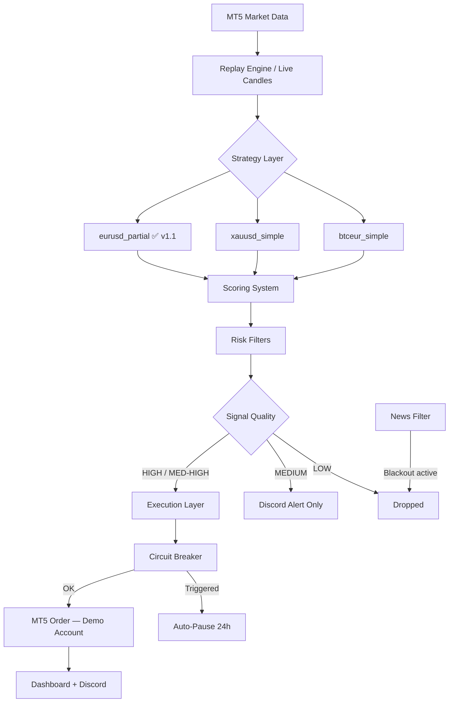
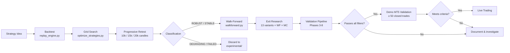

<div align="center">

# LastEdge

**Quantitative Trading Research Framework**

Backtesting · Optimization · Exit Research · MT5 Demo Validation · Discord Integration · Mobile App


</div>

---

## What is this?

LastEdge is a personal quantitative research framework built around MetaTrader 5. It combines a strategy engine, a full backtesting pipeline, an Exit Research system, and a mobile monitoring app into a single modular codebase.

The goal is not to chase high backtest numbers. It is to find strategies that survive when market conditions change — then validate them rigorously before committing real capital.

> **Current phase:** Demo MT5 validation — `eurusd_partial` (partial close, validated via Exit Research Jul 2026).  
> No live capital is at risk. All validation runs on a MetaTrader 5 Demo account.

---

## Overview

```
Strategy ideas → Backtest → Optimization → Progressive Retest → Walk-Forward → Exit Research → Demo MT5 → Live
```

| Layer | What it does |
|---|---|
| **Strategy Engine** | Evaluates EURUSD, XAUUSD, BTCEUR every 20s on H1 candles |
| **Scoring System** | Assigns confidence levels (LOW / MEDIUM / HIGH) to each signal |
| **Risk Management** | Dynamic lot sizing, circuit breaker, drawdown protection |
| **Backtesting** | Replay engine using the same pipeline as production |
| **Optimization** | Grid search over SL/TP/CB parameter space |
| **Progressive Retest** | Auto-classifies strategies at 10k / 15k / 20k candles |
| **Walk-Forward** | Detects overfitting via rolling TRAIN/TEST windows |
| **Exit Research** | Compares 13 exit variants per strategy using MAE/MFE/Monte Carlo |
| **Discord Bot** | 17 slash commands for monitoring, analysis, and control |
| **Dashboard** | Web UI on `localhost:8080` with real-time equity and signal table |
| **Mobile App** | React Native + Express API for Android monitoring |

---

## Architecture



---

## Project Status

### ✅ Completed (v1.1)

- Multi-strategy signal engine (EURUSD, XAUUSD, BTCEUR)
- Full backtesting pipeline with real trade costs included
- Grid search optimizer (~7h run, 200+ parameter combinations)
- Progressive retest framework (10k / 15k / 20k candles, auto-classification)
- Walk-forward testing with TRAIN/TEST rolling windows
- Monte Carlo simulation (2000 simulations, ruin probability, drawdown percentiles)
- **Exit Research framework** — compares 13 exit variants per strategy with MAE/MFE/WF/MC
- **Validation pipeline** — phases 3–8 with stability, WF, MC, and recommendation engine
- **eurusd_partial** — first strategy promoted via Exit Research (PF=1.85, WR=54%, MC Ruin=0%)
- Circuit breaker with dynamic risk scaling and disk persistence
- News event filter (exact 2025–2026 dates: NFP, CPI, FOMC, ECB)
- Real-time web dashboard with equity simulation and Chart.js curve
- Discord bot with 17 slash commands
- Automatic weekly summary (Discord, every Monday 08:00 UTC)
- MT5 watchdog with auto-reconnect (non-blocking asyncio)
- Trade costs model (spread + commission per symbol)
- Trailing stops with breakeven, partial close, and dynamic trailing
- Market opening alerts (London, New York sessions)
- Session summary system (London close 17h, NY close 22h UTC)
- Encrypted MT5 credentials via Fernet
- Mobile app (React Native + Express API) with dashboard, signals, and history
- Trade journal with SQLite (full trade history with metadata)
- Backtest queue system (processes tasks from mobile app)

### 🔄 In Progress

- Demo MT5 validation of `eurusd_partial` (target: ≥ 50 closed trades, WR ≥ 48%)

### 📋 Planned

- Exit Research for XAUUSD and BTCEUR
- Automated go-live criteria verification (`/go_live_check` command)
- Live trading (after demo validation criteria are met)

---

## Strategy Ecosystem

### Active Strategies

| Symbol | Strategy | Exit | SL | TP | WR (20k) | PF (20k) | MC Ruin | Notes |
|---|---|---|---|---|---|---|---|---|
| EURUSD | `eurusd_partial` | 50% Partial + Trailing | 1.5× ATR | 2×ATR + trail | 54.1% | **1.85** | **0.0%** | ✅ Validated via Exit Research Jul 2026 |
| XAUUSD | `xauusd_simple` | Fixed RR | 2.0× ATR | 5.0× ATR | 35.5% | **1.17** | — | ✅ ROBUST |
| BTCEUR | `btceur_simple` | Fixed RR | 2.0× ATR | 3.0× ATR | 46.4% | **1.23** (10k) | — | ⚠️ INCONCLUSIVE |

All results include real spread + commission costs for a Professional account.

### Reference (not active)

| Strategy | Symbol | Notes |
|---|---|---|
| `eurusd_simple` | EURUSD | Previous production config — SL 1.5×ATR, TP 6×ATR, RR 1:4. Superseded by `eurusd_partial`. |
| `xauusd_momentum` | XAUUSD | ROBUST, small sample (78 trades) |
| `btc_trend_pullback_v1` | BTCEUR | CB triggered on 53% of signals |
| `btceur_weekly_breakout` | BTCEUR | PF inflated by CB; not validated without it |
| `btceur_regime_momentum` | BTCEUR | H4+Daily; functional with `required_timeframe` mechanism |

### Discarded (`strategies/experimental/`)

| Strategy | Symbol | Reason |
|---|---|---|
| `eurusd_asian_breakout` | EURUSD | PF < 1.0 at 10k / 15k / 20k with real costs |
| `eurusd_mtf` | EURUSD | PF 0.46 — no edge |
| `xauusd_psychological` | XAUUSD | Negative PF |
| `xauusd_reversal` | XAUUSD | 1–3 signals per 5000 candles — too restrictive |

---

## Research Pipeline



### Exit Research — what it evaluates

For each active strategy, 13 exit variants are compared using 20,000 H1 candles:

| Metric group | Metrics |
|---|---|
| Profitability | PF, Net Pips, Win Rate, Expectancy, Avg Win, Avg Loss |
| Risk | Max Drawdown, Consecutive Losses, Recovery Factor |
| Exit quality | MAE Winners/Losers, MFE Winners/Losers, Profit Captured % |
| Robustness | Walk-Forward (4 windows), Monte Carlo (2000 simulations), Stability Score (0–100) |

### Validation criteria for going live

A strategy must satisfy **all** of the following:

1. Progressive retest classification: **ROBUST** or **STABLE**
2. Exit Research: Stability Score ≥ 20, WF MARGINAL or better, MC Ruin ≤ 5%
3. PF ≥ 1.20 in Demo MT5 with ≥ 50 closed trades
4. Demo winrate within ±10 percentage points of backtest winrate
5. Demo drawdown < 10% of allocated capital
6. PF > 1.0 **without** circuit breaker

### Trade costs included in all backtests

| Symbol | Spread | Commission | Round-trip |
|---|---|---|---|
| EURUSD | 1.2 pips | 0.3 pips | **1.5 pips** |
| XAUUSD | 3.5 pips | 0.3 pips | **3.8 pips** |
| BTCEUR | 25.0 pips | 0.3 pips | **25.3 pips** |

---

## Project Structure

```
LastEdge/  (c:\BOT-MT5)
├── bot.py                      # Entry point — Discord bot + MT5
├── signals.py                  # Strategy dispatcher
├── rules_config.json           # Per-symbol configuration (active: eurusd_partial)
│
├── core/
│   ├── engine.py               # Main signal engine + BotState
│   ├── scoring.py              # Confidence scoring system
│   ├── risk.py                 # Lot sizing and drawdown protection
│   ├── filters.py              # Duplicate and cooldown filters
│   ├── replay_engine.py        # Backtesting replay loop
│   ├── circuit_breaker.py      # Auto-pause on losing streaks
│   ├── walkforward.py          # Rolling TRAIN/TEST validation
│   ├── trade_costs.py          # Spread + commission model
│   ├── montecarlo.py           # Monte Carlo simulation (2000 runs)
│   ├── journal.py              # Trade journal with SQLite
│   └── exit_research/          # Exit strategy research pipeline (isolated)
│       ├── runner.py           # Orchestrates all exit research phases
│       ├── variants.py         # 12 exit variants implemented
│       ├── metrics.py          # MAE/MFE/Stability Score computation
│       └── strategy_adapter.py # Adapts any strategy to the runner
│
├── services/
│   ├── autosignals.py          # Scan loop (every 20s)
│   ├── dashboard.py            # Web dashboard (port 8080)
│   ├── execution.py            # MT5 order execution
│   ├── logging.py              # Session logging system
│   ├── news_filter.py          # High-impact event blackout
│   ├── commands_refactored.py  # Discord slash commands
│   ├── database.py             # SQLite persistence
│   └── mobile_store.py         # Mobile app data bridge
│
├── strategies/
│   ├── base.py                 # BaseStrategy abstract class
│   ├── eurusd.py               # EURUSDPartialStrategy (active) + EURUSDStrategy (legacy)
│   ├── xauusd.py               # xauusd_simple + momentum (active)
│   ├── btceur_new.py           # btceur_simple (active)
│   ├── btc_trend_pullback_v1.py
│   ├── btceur_weekly_breakout.py
│   ├── btceur_regime_momentum.py
│   └── experimental/           # Discarded strategies (reference only)
│
├── run_exit_research.py        # Run Exit Research for EURUSD
├── run_validation.py           # Run validation pipeline (phases 3-8)
│
├── backtest_results/
│   ├── exit_research/          # Exit Research sessions
│   │   └── 20260702_225143/    # EURUSD exit research (13 variants, 20k bars)
│   ├── validation/             # Validation pipeline sessions
│   │   ├── val_20260703_160132/        # EURUSD partial_close validation
│   │   └── EURUSD_PARTIAL_CLOSE_DECISION.md  # Decision record
│   ├── optimization/           # Grid search JSONs
│   └── monte_carlo/            # Standalone Monte Carlo results
│
├── tests/
│   ├── backtest_runner.py      # CLI backtest with CB simulation
│   ├── optimize_strategies.py  # Grid search
│   └── ...
│
├── mobile-app/                 # React Native + Express API
├── start_bot.bat               # Start Python bot
├── start_all.bat               # Start bot + API server
├── requirements.txt
└── .env.example
```

---

## Installation

**Prerequisites:** Python 3.11+, MetaTrader 5 desktop app, a Discord bot token.

```bash
# 1. Clone the repository
git clone https://github.com/imlast999/BOT-MT5.git
cd BOT-MT5

# 2. Copy and fill in the environment file
copy .env.example .env
# Edit .env with your Discord token, MT5 credentials, etc.

# 3. Install dependencies and start
start_bot.bat

# Or manually
pip install -r requirements.txt
python bot.py
```

`.env` minimum required fields:

```env
DISCORD_TOKEN=your_token
GUILD_ID=your_server_id
AUTHORIZED_USER_ID=your_user_id
MT5_LOGIN=your_mt5_login
MT5_PASSWORD=your_mt5_password
MT5_SERVER=YourBroker-Demo
```

---

## Usage

### Starting the bot (Demo MT5 validation mode)

```bash
start_bot.bat
# Dashboard available at http://localhost:8080
# Bot connects to MT5 Demo and starts scanning every 20s
```

The bot uses the Demo MT5 account configured in `.env`. No live capital involved.

### Running Exit Research

```bash
# Full exit research for EURUSD (20,000 H1 bars, ~90 minutes)
python run_exit_research.py --bars 20000

# Quick analysis (5,000 bars)
python run_exit_research.py --bars 5000
```

Results saved to `backtest_results/exit_research/{run_id}/`.

### Running the validation pipeline

```bash
# Validate finalist variants (phases 3-8)
python run_validation.py

# Specify variants explicitly
python run_validation.py --variants partial_close rr_1_3

# Dry run (check config only)
python run_validation.py --dry-run
```

Results saved to `backtest_results/validation/{run_id}/`.

### Running backtests

```bash
# Single strategy
python tests/backtest_runner.py --symbol EURUSD --strategy eurusd_partial --bars 10000 --save

# With walk-forward
python tests/backtest_runner.py --symbol EURUSD --bars 10000 --walkforward

# All active strategies
tests\run_full_backtest.bat
```

### Running optimization

```bash
tests\run_optimization.bat
python tests\apply_optimization.py backtest_results/optimization/optimization_YYYYMMDD.json
```

---

## Discord Commands

| Category | Command | Description |
|---|---|---|
| **Control** | `/autosignals on\|off\|status` | Start, stop, or check the signal scan loop |
| | `/status` | Bot uptime, MT5 connection, loaded modules |
| | `/pairs` | Toggle monitoring per symbol |
| | `/logs_info` | Current log file path and size |
| **MT5** | `/positions` | List open MT5 positions with P&L |
| | `/close_position [ticket]` | Close a position by ticket number |
| | `/close_positions_ui` | Close positions via dropdown |
| | `/set_mt5_credentials` | Update MT5 login without editing `.env` |
| **Signals** | `/signal [symbol]` | Request a manual signal for a pair |
| | `/chart [symbol] [tf] [n]` | Generate a candlestick chart PNG |
| | `/force_autosignal [symbol]` | Trigger an immediate scan |
| | `/debug_signals [symbol]` | Show full evaluation pipeline with rejection reasons |
| | `/diagnose_signals [symbol] [n]` | Analyze N historical windows for signal detection |
| | `/replay` | Run a backtest from Discord via modal form |
| **Stats** | `/performance [days]` | Winrate and P&L report |
| | `/strategy_performance [days]` | Per-strategy breakdown |
| | `/set_strategy [symbol] [name]` | Hot-swap strategy without restart |
| | `/bot_status` | Circuit breaker state and per-symbol cooldowns |
| | `/news` | Upcoming high-impact events with blackout windows |
| | `/equity` | Live equity snapshot (closed + floating P&L) |

---

## Risk Management

### Circuit Breaker

| Condition | Action |
|---|---|
| 2 consecutive losses | Risk × 0.8 |
| 3 consecutive losses | Risk × 0.5 |
| **4 consecutive losses** | **Auto-pause for 168 candles (~1 week H1)** |
| 3 consecutive wins | Risk × 1.4 |
| 5 consecutive wins | Risk × 1.8 |
| 7 consecutive wins | Risk × 2.0 |

### News Filter

Pauses trading 30 minutes before and after high-impact events (2025–2026 hardcoded dates).

### Trailing Stops / Partial Close

The active EURUSD strategy (`eurusd_partial`) uses a validated partial close mechanism:

| Event | Action |
|---|---|
| Price reaches 2× ATR profit | Close 50% of position |
| Remaining 50% | Trailing SL at 1.5× ATR |
| Max profit target | 5× ATR from entry |

### Operational limits

| Rule | Value |
|---|---|
| Startup cooldown | 2 minutes |
| Max trades per 12h (global) | 5 |
| EURUSD cooldown | 10 candles |
| XAUUSD cooldown | 240 minutes |
| BTCEUR cooldown | 60 minutes |
| XAUUSD session | 06:00–22:00 UTC only |

---

## Demo MT5 Validation Phase

This version (v1.1) marks the beginning of the Demo MT5 validation phase for `eurusd_partial`.

**Philosophy for this phase: observe before intervening.**

- No parameter changes during validation
- No strategy swaps during validation
- No optimizations during validation
- Only data collection and comparison against backtest expectations

### Metrics to monitor

| Metric | Backtest baseline | Alert threshold |
|---|---|---|
| Win Rate | 54.1% | < 48% after 30 trades |
| Profit Factor | 1.85 | < 1.20 after 50 trades |
| Max Drawdown | 2,125 pips | > 3,000 pips from peak |
| Expectancy | 7.88 pips/trade | < 3.0 pips/trade |
| Partial close rate | ~50% of trades | < 30% (would indicate execution issue) |

---

## Development Philosophy

**Robustness over complexity** — A strategy with PF 1.15 that works across different market regimes is more valuable than one with PF 1.60 that only works in a bull run.

**Evidence over assumptions** — Every claim about a strategy's performance is backed by backtests on real H1 data with actual trade costs included. No theoretical PF numbers.

**Validation before deployment** — The progression from backtest → optimization → progressive retest → walk-forward → exit research → demo MT5 exists specifically to avoid deploying strategies that work in-sample but fail out-of-sample.

**Reproducibility first** — Every research session saves a full JSON with exact parameters, timestamp, candle count, and results. Results can be reproduced months later.

**Single developer scope** — The system is intentionally sized for one person to maintain. No microservices, no Docker, no cloud infrastructure. Just a Python process and a running MT5 terminal.

---

## Changelog

### v1.1 — LastEdge (July 2026)
- **New:** Exit Research framework (`core/exit_research/`, `run_exit_research.py`)
- **New:** Validation pipeline phases 3–8 (`run_validation.py`)
- **New:** `EURUSDPartialStrategy` — first strategy promoted via quantitative exit research
- **Changed:** EURUSD production config updated from `eurusd_simple` (RR 1:4) to `eurusd_partial` (partial close + trailing)
- **Changed:** Project renamed from BOT-MT5 to LastEdge
- **Changed:** Demo MT5 replaces internal paper trading as the validation mechanism

### v1.0 — BOT-MT5 (May–June 2026)
- Grid search optimizer
- Progressive retest framework
- Walk-forward testing
- Monte Carlo simulation
- Trade journal (SQLite)
- Discord bot (17 commands)
- Web dashboard
- Mobile app (React Native)

---

## License

MIT — use it, fork it, learn from it.

---

<div align="center">
<sub>Built to understand markets, not to get rich quick.</sub>
</div>
