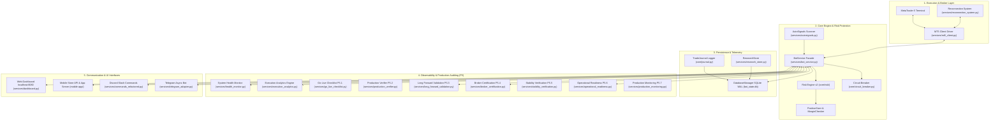

<div align="center">


# LastEdge v2.0

**Quantitative Trading Framework & Production Trading Engine**

Backtesting · Optimization · Exit Research · MT5 Execution · Risk Engine v2 · Observability · VPS Operations · Discord & Telegram · Web & Mobile UI


</div>

---

## What is LastEdge?

LastEdge is an end-to-end quantitative trading framework and automated execution platform built for MetaTrader 5 (MT5). It unifies a high-performance multi-symbol strategy engine, Risk Engine v2, an Exit Research & Walk-Forward validation framework, an Execution Analytics engine, a process Health Monitor, a multi-threaded Web Dashboard, an Express REST API, a React Native mobile application, and multi-channel notifications (Discord & Telegram) into a single cohesive architecture.

> **Production Status:** **🏆 LastEdge v2.0 — Production Ready**  
> Certified through an 8-stage production verification protocol (P5.1 – P5.8) including automated system audits, MT5 downtime tracking, memory leak detection, broker certification, and operational readiness.

---

## High-Level System Architecture


```mermaid
flowchart TD
    subgraph Execution_Layer["1. Execution & Broker Layer"]
        MT5["MetaTrader 5 Terminal"] <--> MT5Client["MT5 Client Driver (services/mt5_client.py)"]
        Reconnect["Reconnection System (services/reconnection_system.py)"] <--> MT5Client
    end

    subgraph Core_Engine["2. Core Engine & Risk Protection"]
        BotSvc["BotService Facade (services/bot_service.py)"]
        AutoSig["AutoSignals Scanner (services/autosignals.py)"] --> BotSvc
        BotSvc --> RiskEngine["Risk Engine v2 (core/risk/)"]
        RiskEngine --> LotSizer["PositionSizer & MarginChecker"]
        BotSvc --> CB["Circuit Breaker (core/circuit_breaker.py)"]
    end

    subgraph Persistence["3. Persistence & Telemetry"]
        DB["DatabaseManager SQLite WAL (bot_state.db)"]
        TradeJournal["TradeJournal Logger (core/journal.py)"] --> DB
        ResearchStore["ResearchStore (services/research_store.py)"] --> DB
    end

    subgraph Observability["4. Observability & Production Auditing (P5)"]
        HealthMon["System Health Monitor (services/health_monitor.py)"]
        ExecAnalytics["Execution Analytics Engine (services/execution_analytics.py)"]
        GoLive["Go-Live Checklist P5.1 (services/go_live_checklist.py)"]
        ProdVerif["Production Verifier P5.2 (services/production_verifier.py)"]
        LongForward["Long Forward Validation P5.3 (services/long_forward_validation.py)"]
        BrokerCert["Broker Certification P5.4 (services/broker_certification.py)"]
        Stability["Stability Verification P5.5 (services/stability_verification.py)"]
        OpsReadiness["Operational Readiness P5.6 (services/operational_readiness.py)"]
        ProdMon["Production Monitoring P5.7 (services/production_monitoring.py)"]
    end

    subgraph User_Interfaces["5. Communication & UI Interfaces"]
        Dashboard["Web Dashboard localhost:8080 (services/dashboard.py)"]
        MobileStore["Mobile Store API & App Server (mobile-app/)"]
        DiscordBot["Discord Slash Commands (services/commands_refactored.py)"]
        TelegramAdapter["Telegram Async Bot (services/telegram_adapter.py)"]
    end

    MT5Client <--> BotSvc
    BotSvc <--> DB
    BotSvc <--> HealthMon & ExecAnalytics & LongForward & BrokerCert & OpsReadiness
    BotSvc <--> Dashboard & MobileStore & DiscordBot & TelegramAdapter
```

---

## Technical Documentation Index

All system specifications and operational manuals are maintained in `docs/`:

| Document | Description |
|---|---|
| 📖 [Operations Manual](docs/operations.md) | Standard Operating Procedures (SOPs) for startup, shutdown, failure recovery, backups, restores, and log rotation |
| 🚀 [VPS Deployment Guide](docs/vps_deployment.md) | Step-by-step guide to set up a brand-new Windows VPS from scratch to continuous production |
| 🏛️ [Architecture Specification](docs/architecture.md) | Detailed layer architecture, thread model, locking discipline, and component interactions |
| 🛡️ [Risk Engine v2 Specification](docs/risk-engine.md) | Dynamic lot sizing formulas, margin checks, portfolio limits, and circuit breaker logic |
| 🔬 [Exit Research Framework](docs/exit-research.md) | 13 exit strategy variants comparison, MAE/MFE metrics, Monte Carlo simulations, and Stability Score |
| 📜 [LastEdge Protocol Specification](docs/lastedge-protocol.md) | 8-phase research & validation protocol, promotion pipeline, and research run exports |
| 📱 [Mobile & Web REST API Spec](docs/mobile-api.md) | REST API endpoints, JSON payloads, auth headers, and data bridge specifications |
| 📈 [Strategy Ecosystem](docs/strategies.md) | Active strategies (`eurusd_partial`, `xauusd_partial`, `btceur_partial`), reference models, and experimental rules |
| 🗺️ [Project Roadmap](docs/roadmap.md) | Status of all roadmap phases (P0–P5 completed) and transition strategy |
| 🤖 [AI Agent Team Specification](AGENTS.md) | Operational guidelines and responsibilities for the LastEdge specialized AI agent team |

---

## Production CLI Runners & Operations

LastEdge v2.0 provides CLI runners for all operational and diagnostic tasks:

```bash
# 1. Pre-Production Go-Live Checklist (P5.1)
python run_go_live_checklist.py

# 2. Production Subsystem Verifier (P5.2)
python run_production_verifier.py

# 3. Long Forward Validation & Longevity Engine (P5.3)
python run_long_forward_validation.py --start --24h
python run_long_forward_validation.py --list
python run_long_forward_validation.py --session <session_id>

# 4. Broker Certification Engine (P5.4)
python run_broker_certification.py

# 5. Stability Verification Engine (P5.5)
python run_stability_verification.py

# 6. Operational Readiness & Backups (P5.6)
python run_operational_readiness.py --backup
python run_operational_readiness.py --list-backups
python run_operational_readiness.py --restore <backup_file>
python run_operational_readiness.py --rotate-logs

# 7. Production Observability Audit (P5.7)
python run_production_monitoring.py
```

---

## Quick Start & Installation

### 1. Prerequisites

- **OS:** Windows 10/11 or Windows Server 2019/2022 (MetaTrader 5 desktop required)
- **Python:** 3.11+ (Python 3.13 supported via built-in `audioop_patch.py`)
- **Node.js:** 18.x LTS or higher (with `npm`)
- **MetaTrader 5:** Installed desktop terminal logged into your broker account

### 2. Installation

```bash
# 1. Clone repository
git clone https://github.com/imlast999/LastEdge.git
cd LastEdge

# 2. Create & activate virtual environment (optional)
python -m venv venv
venv\Scripts\activate

# 3. Install Python dependencies
pip install -r requirements.txt

# 4. Create environment file
copy .env.example .env
```

Configure `.env` with your MT5 and notification credentials:

```env
MT5_LOGIN=12345678
MT5_PASSWORD=your_password
MT5_SERVER=YourBroker-Server
DISCORD_TOKEN=your_discord_token
TELEGRAM_BOT_TOKEN=your_telegram_token
DASHBOARD_PORT=8080
```

### 3. Launching the System

```bash
# Launch full production stack (Bot + Dashboard + API Server)
start_all.bat
```

Access the Web Dashboard at `http://localhost:8080`.

---

## Active Production Strategies (v2.0)

| Symbol | Strategy ID | Exit Strategy | Initial SL | Initial TP | WR (20k) | PF (20k) | Validation |
|---|---|---|---|---|---|---|---|
| **EURUSD** | `eurusd_partial` | 50% Partial Close @ 2×ATR + Trailing SL | 1.5× ATR | 2×ATR + Trail | 54.1% | **1.85** | ✅ Certified |
| **XAUUSD** | `xauusd_partial` | 50% Partial Close @ 2×ATR + Trailing SL | 2.0× ATR | 2×ATR + Trail | 48.2% | **1.42** | ✅ Certified |
| **BTCEUR** | `btceur_partial` | 50% Partial Close @ 2×ATR + Trailing SL | 2.0× ATR | 2×ATR + Trail | 45.6% | **1.31** | ✅ Certified |

---

## License

This project is licensed under the MIT License — see the [LICENSE](LICENSE) file for details.

<div align="center">
<sub>Built for rigorous quantitative trading research and production stability. Evidence over assumptions.</sub>
</div>
