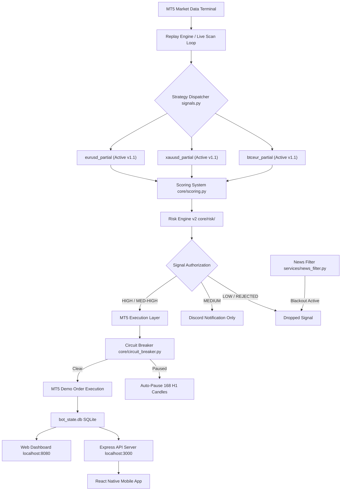

<div align="center">


# LastEdge

**Quantitative Trading Research Framework**

Backtesting · Optimization · Exit Research · MT5 Demo Validation · Discord Integration · Web Dashboard · Mobile App


</div>

---

## What is LastEdge?

LastEdge is a personal quantitative trading research framework built around MetaTrader 5 (MT5). It integrates a high-performance strategy engine, a full backtesting & walk-forward pipeline, an Exit Research framework, a multi-threaded web dashboard, a Node.js REST API server, and a React Native mobile application into a single cohesive repository.

The goal of LastEdge is not to overfit historical data or chase artificially high backtest metrics. It is to discover strategies that maintain an edge across changing market regimes — validating them through an 8-phase quantitative research protocol before deploying them to live MetaTrader 5 environments.

> **Current Phase:** Demo MT5 Validation — Promoted partial-close strategy variants (`eurusd_partial`, `xauusd_partial`, `btceur_partial`) validated via Exit Research (July 2026).  
> **Risk Warning:** No live capital is at risk. All validation runs on a MetaTrader 5 Demo account.

---

## Overview

```
Strategy Setup → Backtest → Grid Search → Progressive Retest → Walk-Forward → Exit Research → Validation Pipeline → Demo MT5 → Live
```

| Layer | Component | Description |
|---|---|---|
| **Strategy Engine** | `signals.py` / `strategies/` | Evaluates EURUSD, XAUUSD, BTCEUR strategies every 20s on H1 candles |
| **Scoring System** | `core/scoring.py` | Assigns confidence levels (LOW / MEDIUM / HIGH) and scores (0-100) |
| **Risk Engine v2** | `core/risk/` | Dynamic lot sizing, margin checks, portfolio exposure limits, circuit breaker |
| **Backtesting Engine** | `core/replay_engine.py` | Deterministic replay loop using exact production pipeline & trade costs |
| **Optimization** | `tests/optimize_strategies.py` | Multi-parameter grid search optimizer with JSON session export |
| **Progressive Retest** | `tests/backtest_runner.py` | Auto-classifies strategies across 10k / 15k / 20k candle horizons |
| **Walk-Forward** | `core/walkforward.py` | Rolling TRAIN/TEST window validation to detect overfitting |
| **Exit Research** | `core/exit_research/` | Compares 13 exit strategy variants using MAE/MFE, WF, Monte Carlo & Stability Score |
| **Validation Pipeline** | `run_validation.py` | Executes Phases 3–8 validation suite and recommendation engine |
| **Discord Bot** | `bot.py` / `services/commands_refactored.py` | 17 slash commands for real-time monitoring, manual backtests, & controls |
| **Web Dashboard** | `services/dashboard.py` | Multi-threaded HTTP server (`ThreadingHTTPServer`) with real-time equity & DOM polling |
| **Node.js REST API** | `mobile-app/.../api-server/` | Express REST API server providing endpoint access to `bot_state.db` and research runs |
| **Mobile App** | `mobile-app/.../mobile/` | React Native (Expo) Android mobile app for remote telemetry, signals, and research lab |

---

## Architecture


```mermaid
flowchart TD
    A[MT5 Market Data Terminal] --> B[Replay Engine / Live Scan Loop]
    B --> C{Strategy Dispatcher signals.py}
    C --> D["eurusd_partial (Active v1.1)"]
    C --> E["xauusd_partial (Active v1.1)"]
    C --> F["btceur_partial (Active v1.1)"]
    D & E & F --> G[Scoring System core/scoring.py]
    G --> H[Risk Engine v2 core/risk/]
    H --> I{Signal Authorization}
    I -->|HIGH / MED-HIGH| J[MT5 Execution Layer]
    I -->|MEDIUM| K[Discord Notification Only]
    I -->|LOW / REJECTED| L[Dropped Signal]
    J --> M[Circuit Breaker core/circuit_breaker.py]
    M -->|Clear| N[MT5 Demo Order Execution]
    M -->|Paused| O[Auto-Pause 168 H1 Candles]
    N --> P[bot_state.db SQLite]
    P --> Q[Web Dashboard localhost:8080]
    P --> R[Express API Server localhost:3000]
    R --> S[React Native Mobile App]
    T[News Filter services/news_filter.py] -->|Blackout Active| L
```

---

## Documentation Index

Detailed documentation files are maintained in `docs/`:

- [Architecture Specification](docs/architecture.md) — System layers, thread model, locking discipline, database bridge, and component interaction.
- [LastEdge Protocol](docs/lastedge-protocol.md) — 8-phase research & validation protocol specification, research runs, and promotion criteria.
- [Exit Research](docs/exit-research.md) — 13 exit variants comparison framework, MAE/MFE metrics, Monte Carlo simulations, and Stability Score.
- [Risk Engine v2](docs/risk-engine.md) — Dynamic lot sizing, position sizer formulas, margin checker, portfolio risk limits, and circuit breaker.
- [Mobile & Web REST API](docs/mobile-api.md) — Comprehensive REST API endpoint definitions, JSON payloads, auth headers, and data bridge specs.
- [Strategy Ecosystem](docs/strategies.md) — Active strategies, reference strategies, discarded experimental strategy rules (`strategies/experimental/`), and strategy authoring guide.
- [Project Roadmap](docs/roadmap.md) — Current implementation state, completion milestones, and planned future evolution.
- [AI Agent Team Specification](AGENTS.md) — Operational guidelines and responsibilities for the LastEdge AI subagent team.

---

## Developer Onboarding & Environment Setup

Follow these steps to set up and run the entire LastEdge stack on your local Windows development environment.

### 1. Prerequisites

- **OS:** Windows 10/11 (MT5 Windows desktop required for live execution)
- **Python:** Version 3.11 or higher
- **Node.js:** Version 18.x LTS or higher (with `npm`)
- **MetaTrader 5:** Installed desktop app logged into a Demo account
- **Discord Bot Token:** (Optional, for Discord notifications & slash commands)

### 2. Python Backend Setup

```bash
# 1. Clone repository
git clone https://github.com/imlast999/LastEdge.git
cd LastEdge

# 2. Create and activate virtual environment (optional but recommended)
python -m venv venv
venv\Scripts\activate

# 3. Install Python dependencies
pip install -r requirements.txt

# 4. Configure environment file
copy .env.example .env
```

Edit `.env` with your environment values:

```env
DISCORD_TOKEN=your_discord_bot_token
GUILD_ID=your_discord_guild_id
AUTHORIZED_USER_ID=your_discord_user_id
MT5_LOGIN=12345678
MT5_PASSWORD=your_demo_password
MT5_SERVER=YourBroker-Demo
DASHBOARD_PORT=8080
API_PORT=3000
AUTO_EXECUTE_SIGNALS=1
AUTO_EXECUTE_CONFIDENCE=HIGH
```

### 3. Node.js API Server Setup

The REST API server powers the Mobile App and external clients by interfacing with `bot_state.db` and the `backtest_results/` directory.

```bash
cd mobile-app/Pasted-Rol-Objective/artifacts/api-server
npm install
npm run build
npm start
```

The API Server starts on `http://localhost:3000`.

### 4. React Native Mobile Application Setup

```bash
cd mobile-app/Pasted-Rol-Objective/artifacts/mobile
npm install

# Start Expo development server
npx expo start

# Or launch on an connected Android emulator/device
npx expo run:android
```

---

## How to Run LastEdge

### Running the Python Engine & Bot (Demo MT5 Validation)

```bash
# Option A: Start bot using Windows batch launcher
start_bot.bat

# Option B: Start bot manually from terminal
python bot.py
```

- **Web Dashboard:** Access `http://localhost:8080` in your web browser.
- **Scanning Loop:** Scans active trading pairs every 20 seconds.
- **MT5 Connection:** Auto-connects to the MT5 Demo terminal specified in `.env`.

### Starting All Services (Bot + API Server)

```bash
start_all.bat
```

### Running Exit Research

To evaluate 13 exit strategy variants on historical candle data:

```bash
# EURUSD Exit Research (20,000 H1 candles)
python run_exit_research.py --bars 20000

# XAUUSD Exit Research
python run_exit_research_xauusd.py --bars 20000

# Quick test run (5,000 bars)
python run_exit_research.py --bars 5000
```

Results are exported to `backtest_results/exit_research/{run_id}/` with `summary.json`, `trades.csv`, `mae_mfe.csv`, and `report.md`.

### Running the Validation Pipeline

```bash
# Execute validation pipeline (Phases 3–8)
python run_validation.py

# Validate specific exit variants
python run_validation.py --variants partial_close rr_1_3

# Configuration check dry-run
python run_validation.py --dry-run
```

Results are saved to `backtest_results/validation/{run_id}/`.

### Running Backtests & Optimizations

```bash
# Single strategy backtest
python tests/backtest_runner.py --symbol EURUSD --strategy eurusd_partial --bars 10000 --save

# Walk-forward backtest
python tests/backtest_runner.py --symbol EURUSD --bars 10000 --walkforward

# Run grid search optimization
python tests/optimize_strategies.py --symbol EURUSD --bars 10000
```

---

## Strategy Ecosystem

### Active Production Strategies (v1.1)

| Symbol | Strategy ID | Exit Latching & Management | Initial SL | Initial TP | WR (20k) | PF (20k) | MC Ruin | Validation Status |
|---|---|---|---|---|---|---|---|---|
| EURUSD | `eurusd_partial` | 50% Partial Close @ 2×ATR + Trailing SL @ 1.5×ATR | 1.5× ATR | 2×ATR + Trail | 54.1% | **1.85** | **0.0%** | ✅ Validated via Exit Research (Jul 2026) |
| XAUUSD | `xauusd_partial` | 50% Partial Close @ 2×ATR + Trailing SL @ 2.0×ATR | 2.0× ATR | 2×ATR + Trail | 48.2% | **1.42** | **0.2%** | ✅ Validated & Promoted |
| BTCEUR | `btceur_partial` | 50% Partial Close @ 2×ATR + Trailing SL @ 2.0×ATR | 2.0× ATR | 2×ATR + Trail | 45.6% | **1.31** | **0.8%** | ✅ Validated & Promoted |

*All performance metrics reflect real spread and commission costs.*

### Reference & Legacy Strategies

| Strategy ID | Symbol | Operational Status & Description |
|---|---|---|
| `eurusd_simple` | EURUSD | Legacy configuration — SL 1.5×ATR, TP 6×ATR (1:4 RR). Superseded by `eurusd_partial`. |
| `xauusd_momentum` | XAUUSD | Reference momentum model. Small trade sample (78 trades / 20k bars). |
| `btc_trend_pullback_v1` | BTCEUR | Reference trend pullback. High CB sensitivity. |
| `btceur_weekly_breakout` | BTCEUR | Weekly breakout model. Maintained for historical comparisons. |
| `btceur_regime_momentum` | BTCEUR | Multi-timeframe H4+Daily regime model with dynamic timeframe detection. |

### Discarded Experimental Strategies (`strategies/experimental/`)

Strategies in `strategies/experimental/` were formally discarded during progressive retesting and grid search optimization. They remain in the codebase strictly for historical reference:

| Strategy File | Symbol | Rejection Reason & Findings |
|---|---|---|
| `strategies/experimental/eurusd_asian_breakout.py` | EURUSD | Failed progressive retest (PF < 1.0 at 10k, 15k, and 20k candle horizons). |
| `strategies/experimental/eurusd_mtf.py` | EURUSD | Severe negative expectancy (PF 0.46) with real trade costs. |
| `strategies/experimental/xauusd_psychological.py` | XAUUSD | Negative Profit Factor across all test windows. |

---

## Risk Engine v2 & Protections

LastEdge enforces strict multi-layered risk limits in `core/risk/`:

### Circuit Breaker (`core/circuit_breaker.py`)

| Loss / Win Streak | Dynamic Scaling Action |
|---|---|
| 2 Consecutive Losses | Risk multiplier scaled to **0.8×** |
| 3 Consecutive Losses | Risk multiplier scaled to **0.5×** |
| **4 Consecutive Losses** | **Trading Auto-Paused for 168 H1 Candles (~1 Week)** |
| 3 Consecutive Wins | Risk multiplier scaled to **1.4×** |
| 5 Consecutive Wins | Risk multiplier scaled to **1.8×** |
| 7 Consecutive Wins | Risk multiplier scaled to **2.0×** |

### Execution Rules & Cooldowns

| Protection Rule | Value | Description |
|---|---|---|
| Startup Cooldown | 2 minutes | System warmup window upon bot start |
| Max Global Trades | 5 trades / 12h | Max total executed trades across all symbols |
| EURUSD Cooldown | 10 H1 candles | Minimum gap between consecutive EURUSD signals |
| XAUUSD Cooldown | 240 minutes | Minimum gap between consecutive XAUUSD signals |
| BTCEUR Cooldown | 60 minutes | Minimum gap between consecutive BTCEUR signals |
| XAUUSD Trading Window | 06:00–22:00 UTC | Restricts Gold trading outside major liquid market sessions |
| News Blackout Filter | ±30 minutes | Pauses trade execution around high-impact economic releases (NFP, CPI, FOMC, ECB) |

---

## Trade Cost Model

Every backtest, walk-forward, and research evaluation incorporates exact broker spread and commission charges:

| Symbol | Spread Cost | Commission Cost | Total Round-Trip Transaction Cost |
|---|---|---|---|
| **EURUSD** | 1.2 pips | 0.3 pips | **1.5 pips** |
| **XAUUSD** | 3.5 pips | 0.3 pips | **3.8 pips** |
| **BTCEUR** | 25.0 pips | 0.3 pips | **25.3 pips** |

---

## Discord Slash Commands

| Category | Slash Command | Function |
|---|---|---|
| **Control** | `/autosignals on\|off\|status` | Start, stop, or check the automated 20s scan loop |
| | `/status` | View bot status, MT5 connection, balance, equity, and uptime |
| | `/pairs` | Toggle monitoring status for individual symbols |
| | `/logs_info` | View current log file path and disk size |
| **MT5 Orders** | `/positions` | List open positions with live P&L and tickets |
| | `/close_position [ticket]` | Close a specific MT5 position by ticket number |
| | `/close_positions_ui` | Interactive UI dropdown to select positions for closure |
| | `/set_mt5_credentials` | Hot-update MT5 login credentials without restart |
| **Signals** | `/signal [symbol]` | Manually evaluate and generate a signal request |
| | `/chart [symbol] [tf] [n]` | Generate and send a candlestick PNG chart |
| | `/force_autosignal [symbol]` | Force an immediate evaluation scan |
| | `/debug_signals [symbol]` | View full signal pipeline decision tree & rejection reasons |
| | `/diagnose_signals [symbol] [n]` | Analyze historical candle windows for signal detection |
| | `/replay` | Launch a backtest via Discord modal interface |
| **Analytics** | `/performance [days]` | Retrieve aggregate winrate, P&L, and trade count |
| | `/strategy_performance [days]` | Per-strategy performance breakdown |
| | `/set_strategy [symbol] [name]` | Hot-swap active strategy for a symbol |
| | `/bot_status` | Circuit breaker status and symbol cooldown countdowns |
| | `/news` | View upcoming high-impact economic news events |
| | `/equity` | Real-time balance and floating equity snapshot |

---

## Project Structure

```
LastEdge/
├── bot.py                      # Main entry point — MT5 client & Discord bot orchestration
├── signals.py                  # Strategy dispatcher & registry loader
├── rules_config.json           # Active symbol & strategy execution configuration
├── requirements.txt            # Python dependencies
├── start_bot.bat               # Windows batch launcher for Python bot
├── start_all.bat               # Windows batch launcher for Bot + API Server
├── .env.example                # Environment variables template
│
├── core/                       # Core Quantitative & Execution Engine
│   ├── engine.py               # Main signal processing engine & BotState
│   ├── scoring.py              # Signal scoring and confidence classifier
│   ├── replay_engine.py        # Deterministic backtesting replay engine
│   ├── circuit_breaker.py      # Circuit breaker & dynamic risk scaling state
│   ├── filters.py              # Signal deduplication & cooldown filters
│   ├── walkforward.py          # Rolling TRAIN/TEST Walk-Forward validator
│   ├── montecarlo.py           # Bootstrap Monte Carlo simulation engine
│   ├── trade_costs.py          # Symbol spread & commission calculation model
│   ├── journal.py              # SQLite Trade Journal logger
│   ├── risk/                   # Risk Engine v2
│   │   ├── engine.py           # RiskEngine coordinator
│   │   ├── position_sizer.py   # Risk-based lot calculation formulas
│   │   ├── margin_checker.py   # Margin & free margin verifier
│   │   └── portfolio_risk.py   # Aggregate portfolio exposure tracker
│   └── exit_research/          # Exit Research Framework
│       ├── runner.py           # Exit research execution orchestrator
│       ├── variants.py         # 13 exit strategy variant implementations
│       ├── metrics.py          # MAE/MFE, Profit Captured, Stability Score computation
│       └── strategy_adapter.py # Adapter connecting strategies to exit runner
│
├── services/                   # Backend Application Services
│   ├── autosignals.py          # Automated 20s market scanning loop
│   ├── dashboard.py            # Web Dashboard (ThreadingHTTPServer, port 8080)
│   ├── execution.py            # MetaTrader 5 order execution service
│   ├── logging.py              # Session logging and file rotation
│   ├── news_filter.py          # High-impact news event blackout service
│   ├── database.py             # SQLite database layer for bot_state.db
│   ├── mobile_store.py         # Mobile store data bridge
│   └── commands_refactored.py  # Discord slash commands definitions
│
├── strategies/                 # Strategy Implementations
│   ├── base.py                 # BaseStrategy abstract base class
│   ├── eurusd.py               # EURUSDPartialStrategy (Active) & EURUSDStrategy (Legacy)
│   ├── xauusd.py               # XAUUSD partial close & momentum strategies (Active)
│   ├── btceur_new.py           # BTCEUR partial close strategy (Active)
│   ├── btc_trend_pullback_v1.py# BTCEUR reference pullback strategy
│   ├── btceur_weekly_breakout.py # BTCEUR reference breakout strategy
│   ├── btceur_regime_momentum.py # BTCEUR multi-timeframe regime strategy
│   └── experimental/           # Discarded strategies (historical reference)
│       ├── eurusd_asian_breakout.py
│       ├── eurusd_mtf.py
│       └── xauusd_psychological.py
│
├── run_exit_research.py        # CLI script for EURUSD exit research
├── run_exit_research_xauusd.py # CLI script for XAUUSD exit research
├── run_validation.py           # CLI script for 8-phase validation pipeline
│
├── docs/                       # Technical Documentation
│   ├── architecture.md         # System architecture & component design
│   ├── exit-research.md        # Exit research methodology & metrics
│   ├── lastedge-protocol.md    # Research & validation protocol spec
│   ├── mobile-api.md           # Mobile REST API & JSON schemas
│   ├── risk-engine.md          # Risk Engine v2 specification
│   ├── strategies.md           # Strategy ecosystem & authoring guide
│   └── roadmap.md              # Project status & future development plan
│
├── mobile-app/                 # Express API Server & React Native Mobile App
│   └── Pasted-Rol-Objective/
│       └── artifacts/
│           ├── api-server/     # Node.js Express REST API server
│           └── mobile/         # React Native (Expo) mobile application
│
└── tests/                      # Unit & Backtest Test Suites
    ├── backtest_runner.py      # Backtest CLI runner
    ├── optimize_strategies.py  # Parameter grid search optimizer
    └── run_full_backtest.bat   # Batch script executing full backtest suite
```

---

## License

This project is licensed under the MIT License — see the [LICENSE](LICENSE) file for details.

---

<div align="center">
<sub>Built for rigorous quantitative trading research. Evidence over assumptions.</sub>
</div>
