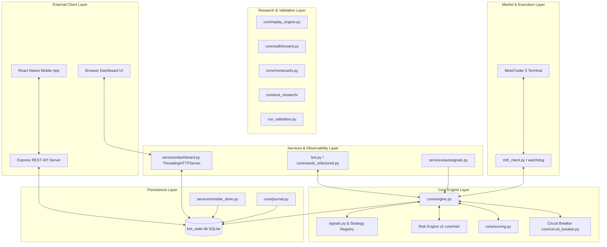
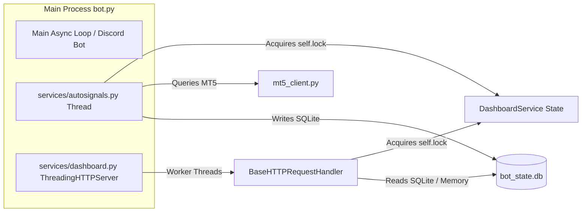

# System Architecture — LastEdge

> **Authoritative Single Source of Truth for System Architecture & Concurrency Design**

---

## 1. Executive Overview

LastEdge is a multi-tier quantitative research and execution architecture designed for MetaTrader 5. It separates statistical strategy generation, risk controls, backtesting, live execution, and multi-platform telemetry into isolated, well-defined layers.

---

## 2. Component Layers & File Map

### Layer 1: Market Data & Execution
- **`mt5_client.py`**: Interprocess wrapper for MetaTrader 5 API. Manages account info, terminal status, bar history fetching, and live order placement.
- **`reconnection_system.py`**: Watchdog monitoring connection health. Implements non-blocking async reconnect attempts with backoff logic.

### Layer 2: Core Engine & Strategy Dispatching
- **`core/engine.py`**: Core signal orchestrator (`TradingEngine`) and global bot state holder (`BotState`).
- **`signals.py`**: Strategy dispatcher and lazy-loader registry (`STRATEGY_REGISTRY`). Evaluates active strategies on H1 candle updates and manages stateful strategy resets via `reset_strategy_instances()`.
- **`strategies/`**: Pure strategy implementations (`base.py`, `eurusd.py`, `xauusd.py`, `btceur_new.py`). Experimental/discarded strategies are strictly isolated in `strategies/experimental/`.
- **`core/scoring.py`**: Multi-factor signal confidence scoring engine (assigns LOW, MEDIUM, HIGH confidence categories and 0-100 numerical scores).
- **`core/filters.py`**: Signal deduplication, candle cooldowns, and symbol blackout filters.

### Layer 3: Risk Engine v2 (`core/risk/`)
- **`core/risk/engine.py`**: `RiskEngine` coordinator enforcing capital preservation policies before order submission.
- **`core/risk/position_sizer.py`**: Dynamic lot size calculator using account balance, fixed fractional risk %, ATR stop loss distance, symbol pip sizes, and lot step rounding.
- **`core/risk/margin_checker.py`**: Account margin requirements verifier ensuring free margin thresholds are respected.
- **`core/risk/portfolio_risk.py`**: Portfolio exposure tracker calculating aggregate open position exposure per pair and account.
- **`core/circuit_breaker.py`**: Loss-streak protection mechanism scaling risk downward on consecutive losses and auto-pausing execution for 168 H1 candles (~1 week) upon 4 consecutive losses.
- **`services/news_filter.py`**: Economic news blackout service pausing signal generation 30 minutes before and after high-impact events (NFP, CPI, FOMC, ECB).

### Layer 4: Research & Validation Pipeline
- **`core/replay_engine.py`**: Deterministic event-driven backtesting engine running the exact production strategy pipeline over historical bars with real trade costs.
- **`core/walkforward.py`**: Rolling TRAIN/TEST window validator measuring out-of-sample performance consistency.
- **`core/montecarlo.py`**: Bootstrap Monte Carlo simulator performing 2,000 equity permutations to compute drawdown percentiles and ruin probability.
- **`core/exit_research/`**: Framework comparing 13 exit strategy variants (`variants.py`, `runner.py`, `metrics.py`) on MAE/MFE, Profit Captured %, and Stability Score (0-100).
- **`run_validation.py`**: Master validation runner executing Phases 3–8 to verify finalist strategy candidates against production promotion criteria.

### Layer 5: Persistence & Database Bridge
- **`bot_state.db`**: Central SQLite database file containing persistent state.
  - `session_trades`: Active and past session trades.
  - `session_stats`: Equity snapshots, P&L metrics, and circuit breaker status.
  - `enhanced_signals`: Historical and pending signals for UI consumption.
  - `trade_journal`: Detailed audit log of completed trades with latency and slippage metrics.
  - `backtest_tasks`: Async research queue for mobile and dashboard execution.
- **`services/database.py`**: Thread-safe SQLite connection pool and helper routines.
- **`services/mobile_store.py`**: Store bridge translating raw engine events into database records consumed by the REST API.

### Layer 6: Services, Web Dashboard & Mobile API
- **`services/autosignals.py`**: Background scan loop triggering signal evaluation every 20 seconds.
- **`services/dashboard.py`**: Multi-threaded Web Dashboard service listening on port 8080 (`ThreadingHTTPServer`). Serves the standalone HTML/Chart.js front-end with real-time equity updates and DOM polling UI.
- **`mobile-app/.../api-server/`**: Express REST API server running on port 3000. Provides read/write REST endpoints (`/api/status`, `/api/signals`, `/api/trades`, `/api/equityHistory`, `/api/risk-dashboard`, `/api/research/*`) for mobile clients.
- **`mobile-app/.../mobile/`**: React Native (Expo) mobile client providing Android monitoring, signals management, and Research Lab.

---

## 3. Threading, Concurrency & Synchronization Model

LastEdge uses a hybrid async/multi-threaded model to guarantee high responsiveness without blocking order execution or market data ingestion.

### Key Concurrency Discipline Rules:
1. **Thread-Safe HTTP Server (`ThreadingHTTPServer`):**
   `services/dashboard.py` subclass `ReusableThreadingHTTPServer(ThreadingHTTPServer)` spawns isolated worker threads per incoming HTTP request. This prevents web client requests or slow network reads from blocking the main trading engine loop.
2. **Lock Discipline (`self.lock`):**
   All internal state updates in `DashboardService` (`metrics`, `signal_history`, `performance_history`) are protected by a dedicated `threading.Lock()`. Database queries and disk I/O operations are intentionally executed **outside** lock acquisition blocks to avoid contention and deadlocks.
3. **Async MT5 Reconnection Watchdog:**
   Reconnection routines in `reconnection_system.py` run on a non-blocking `asyncio` loop, allowing Discord commands and health metrics to respond even if the MT5 terminal is temporarily disconnected.
4. **DOM Polling & Responsive UI:**
   The Web Dashboard front-end uses efficient interval DOM polling (configurable 3s-30s) against `/api/data` and `/api/equity`, handling connection losses gracefully without UI freezes.

---

## 4. Communication & Data Flow Sequence

1. **Market Event Ingestion:** `services/autosignals.py` ticks every 20 seconds, requesting H1 candle bars from `mt5_client.py`.
2. **Signal Generation:** Bars are passed to `signals.py`, which delegates to the active strategy instance (`eurusd_partial`, `xauusd_partial`, or `btceur_partial`).
3. **Scoring & Risk Filtering:** If a setup is detected, `core/scoring.py` evaluates confidence. If score >= threshold, `core/risk/engine.py` calculates position sizing, verifies margin via `MarginChecker`, checks portfolio correlation in `PortfolioRisk`, and checks `CircuitBreaker` status.
4. **Execution & Event Logging:** Authorized signals are dispatched to `services/execution.py` for MT5 order placement. Trade metadata is recorded in `bot_state.db` via `services/mobile_store.py` and `core/journal.py`.
5. **Dashboard & Mobile Telemetry:** Web Dashboard (`services/dashboard.py`) and Express API Server ingest SQLite state changes and serve real-time JSON payloads to browser users and the React Native Mobile App.

---

## 5. System Requirements & Operational Topology

- **Single Machine Co-location:** Python Engine and MetaTrader 5 terminal run on the same Windows host to achieve sub-millisecond execution latency.
- **SQLite Single-Writer Model:** `bot_state.db` utilizes WAL (Write-Ahead Logging) mode to allow concurrent non-blocking reads by the Express API server while the Python process writes.
