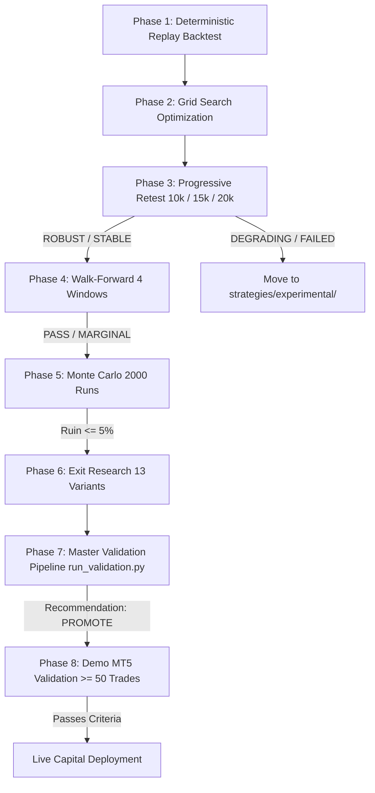

# LastEdge Research & Validation Protocol

> **Authoritative Specification for Strategy Research, Validation Pipelines, and Production Promotion**

---

## 1. Executive Summary & Purpose

The **LastEdge Protocol** is a standardized, 8-phase quantitative research methodology required for every trading strategy prior to live deployment. 

The core philosophy of the protocol is **reproducibility and evidence over assumptions**. No strategy or exit logic is promoted based on single-window backtests, un-costed theoretical fills, or subjective intuition. Every candidate must pass deterministic backtesting, progressive retesting, walk-forward analysis, Monte Carlo simulation, exit research, and demo forward validation.

---

## 2. The 8-Phase Validation Pipeline



### Phase 1: Historical Data Ingestion & Deterministic Backtesting
- **Tooling:** `core/replay_engine.py` / `tests/backtest_runner.py`
- **Dataset:** 10,000–20,000 H1 candles per pair.
- **Trade Cost Model:** Mandatory spread + commission deductions per pair (EURUSD: 1.5 pips, XAUUSD: 3.8 pips, BTCEUR: 25.3 pips).
- **Output:** Baseline Profit Factor, Win Rate, Max Drawdown, and Trade Journal.

### Phase 2: Multi-Parameter Grid Search Optimization
- **Tooling:** `tests/optimize_strategies.py`
- **Search Space:** Systematic grid search across SL multiplier (1.0–3.0× ATR), TP multiplier (1.5–6.0× ATR), and Circuit Breaker thresholds (~200+ combinations over ~7 hours execution).
- **Output:** Parameter landscape JSON (`backtest_results/optimization/`) and top candidate selection.

### Phase 3: Progressive Retest Horizon Analysis
- **Tooling:** Progressive retest classifier in `tests/backtest_runner.py`
- **Methodology:** Evaluates candidate strategy across three expanding candle horizons: 10,000 bars (~1.5y), 15,000 bars (~2.2y), and 20,000 bars (~3y).
- **Classification Categories:**
  - **ROBUST:** Profit Factor maintained or improved across all horizons (PF ≥ 1.30).
  - **STABLE:** Minor degradation but remains profitable (PF ≥ 1.15).
  - **DEGRADING:** PF drops significantly as horizon expands (PF < 1.15). Relocated to `strategies/experimental/`.
  - **FAILED:** Negative Profit Factor (PF < 1.0). Relocated to `strategies/experimental/`.

### Phase 4: Walk-Forward Rolling Windows Validation
- **Tooling:** `core/walkforward.py`
- **Methodology:** Divides historical dataset into 4 rolling TRAIN (in-sample) and TEST (out-of-sample) windows.
- **Evaluation:** Measures out-of-sample degradation factor. Strategy must achieve **PASS** or **MARGINAL** classification across windows.

### Phase 5: Bootstrap Monte Carlo Simulation
- **Tooling:** `core/montecarlo.py`
- **Methodology:** Performs 2,000 bootstrap simulations with trade replacement to stress-test trade sequence sensitivity.
- **Evaluation:**
  - Ruin Probability (equity loss ≥ 50%): Must be **≤ 5.0%**.
  - Drawdown Percentiles: Evaluates 5th, 25th, 50th, 75th, and 95th percentile equity curves.

### Phase 6: Exit Research Evaluation
- **Tooling:** `core/exit_research/` / `run_exit_research.py`
- **Methodology:** Compares 13 exit strategy variants on the exact same entry setups.
- **Evaluation:** Computes MAE/MFE, Profit Captured %, and Stability Score (0–100). Finalist exit variant (e.g. `partial_close`) is selected.

### Phase 7: Master Validation Pipeline & Recommendation Engine
- **Tooling:** `run_validation.py`
- **Methodology:** Integrates output from Phases 3–6, evaluating candidate variants against strict production criteria.
- **Output:** Writes formal decision markdown record (e.g. `backtest_results/validation/EURUSD_PARTIAL_CLOSE_DECISION.md`).

### Phase 8: MetaTrader 5 Demo Forward Validation
- **Tooling:** `bot.py` connected to MT5 Demo account.
- **Target:** Real-time forward execution for **≥ 50 closed trades**.
- **Monitoring Philosophy:** Observe before intervening. No parameter tuning during live demo validation.

---

## 3. The Research Run Unit

A **Research Run** is the fundamental atomic unit of the LastEdge Protocol. Every run generates a deterministic JSON summary containing:

1. **System & Environment Metadata:** Timestamp, git commit hash, Python version, rules config snapshot.
2. **Dataset Parameters:** Symbol, timeframe, starting candle bar index, ending candle bar index, bar count.
3. **Transaction Costs:** Applied spread in pips, commission per lot.
4. **Performance Summary:** PF, Win Rate, Total Trades, Net Pips, Max DD pips, Expectancy.
5. **Robustness Scores:** Stability Score, Walk-Forward pass rate, Monte Carlo ruin %.

---

## 4. Formal Promotion & Go-Live Criteria

To complete Phase 8 and qualify for live capital deployment, a strategy must satisfy **all** of the following requirements:

| Metric / Criteria | Production Threshold |
|---|---|
| Progressive Retest | **ROBUST** or **STABLE** classification |
| Exit Research Stability Score | **≥ 20.0** |
| Monte Carlo Ruin Probability | **≤ 5.0%** across 2,000 runs |
| Demo MT5 Closed Trades | **≥ 50 closed trades** |
| Demo MT5 Profit Factor | **≥ 1.20** |
| Demo Win Rate Stability | Within **±10 percentage points** of backtest baseline |
| Demo Max Drawdown | **< 10%** of allocated account equity |
| Organic Edge | Profit Factor **> 1.0** without Circuit Breaker intervention |

---

## 5. Protocol Command Reference

```bash
# Phase 1 & 3: Run Progressive Retest Backtest
python tests/backtest_runner.py --symbol EURUSD --strategy eurusd_partial --bars 20000 --save

# Phase 4: Run Walk-Forward Analysis
python tests/backtest_runner.py --symbol EURUSD --bars 20000 --walkforward

# Phase 6: Run Exit Research
python run_exit_research.py --bars 20000

# Phase 7: Run Master Validation Pipeline
python run_validation.py --variants partial_close
```
