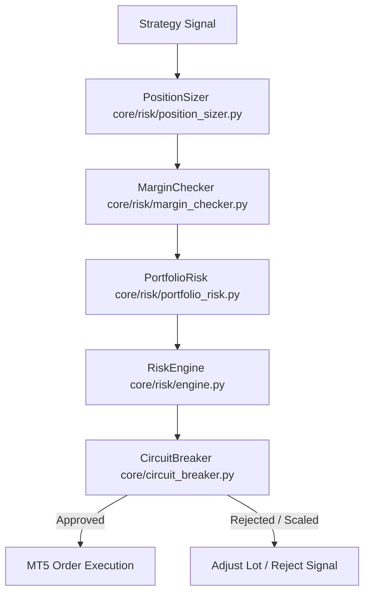

# Risk Engine v2 — Specification & Risk Controls

> **Authoritative Single Source of Truth for LastEdge Risk Management & Exposure Controls**

---

## 1. Overview & Architecture

Risk management in LastEdge is enforced by **Risk Engine v2** (`core/risk/`). It acts as an mandatory gatekeeper before any strategy signal is executed in MetaTrader 5 or simulated in backtesting.

Unlike legacy single-file risk checkers, Risk Engine v2 uses a decoupled, modular architecture composed of four core classes:

---

## 2. Core Risk Modules (`core/risk/`)

### 1. `PositionSizer` (`core/risk/position_sizer.py`)
Calculates the exact position volume (lot size) for a proposed signal based on fixed-fractional monetary risk per trade, Stop Loss distance in pips, and symbol-specific contract specifications.

#### Position Sizing Formula
$$\text{Risk Amount (\$) } = \text{Account Balance} \times \text{Max Risk \% per Trade}$$

$$\text{Volume (Lots)} = \frac{\text{Risk Amount (\$)}}{\text{Stop Loss (Pips)} \times \text{Pip Value per Lot (\$)}}$$

#### Symbol Contract & Sizing Rules

| Symbol | Pip Size | Tick Value Base | Min Lot | Max Lot | Volume Step |
|---|---|---|---|---|---|
| **EURUSD** | 0.0001 (1 pip) | $10.00 / lot / pip | 0.01 | 100.0 | 0.01 (micro lot) |
| **XAUUSD** | 0.10 (1 pip = $0.10) | $10.00 / lot / pip | 0.01 | 50.0 | 0.01 (micro lot) |
| **BTCEUR** | 1.00 (1 pip = €1.00) | €1.00 / lot / pip | 0.01 | 10.0 | 0.01 (micro lot) |

- Volume step rounding enforces standard broker lot discretization (`round(lot / step) * step`).
- Clamps computed volume between `min_lot` and `max_lot`.

---

### 2. `MarginChecker` (`core/risk/margin_checker.py`)
Validates that the account possesses sufficient free margin to support the proposed trade without breaching leverage rules or triggering margin calls.

- **Required Margin Formula:**
$$\text{Required Margin} = \frac{\text{Volume (Lots)} \times \text{Contract Size} \times \text{Current Price}}{\text{Account Leverage}}$$
- **Validation Rule:** Rejects trade execution if `Free Margin - Required Margin < Min Free Margin Buffer` (default buffer: $500.00 or 20% of balance).

---

### 3. `PortfolioRisk` (`core/risk/portfolio_risk.py`)
Tracks aggregate portfolio exposure across all active open positions and symbol correlations.

- **Symbol Exposure Limit:** Restricts maximum open positions per symbol (default: max 1 open trade per symbol).
- **Portfolio Drawdown Limit:** Tracks overall open floating loss against starting session balance.
- **Correlation Safeguards:** Prevents opening concurrent long positions in highly correlated currency pairs.

---

### 4. `RiskEngine` Coordinator (`core/risk/engine.py`)
Orchestrates the entire evaluation flow:
1. Passes proposed signal through `PositionSizer`.
2. Queries `MarginChecker` for account margin headroom.
3. Consults `PortfolioRisk` for exposure limits.
4. Applies `CircuitBreaker` dynamic risk scaling multiplier.
5. Returns final authorization decision: `{ "status": "APPROVED" | "REJECTED", "lot": float, "reason": str }`.

---

## 3. Dynamic Circuit Breaker (`core/circuit_breaker.py`)

The Circuit Breaker protects the account against adverse market regimes, trending drawdown streaks, and volatile slippage spikes.

| Consecutive Loss / Win Streak | Dynamic Risk Multiplier | System Action |
|---|---|---|
| Baseline (0 Streak) | **1.00×** | Normal risk per trade (default 0.5% – 1.0%) |
| 2 Consecutive Losses | **0.80×** | Scales risk down to 80% of normal lot |
| 3 Consecutive Losses | **0.50×** | Scales risk down to 50% of normal lot |
| **4 Consecutive Losses** | **0.00×** | **Auto-Pauses Trading for 168 H1 Candles (~1 Week)** |
| 3 Consecutive Wins | **1.40×** | Scales risk up to 140% after streak confirmation |
| 5 Consecutive Wins | **1.80×** | Scales risk up to 180% |
| 7 Consecutive Wins | **2.00×** | Maximum cap at 200% baseline risk |

State is persisted to disk (`circuit_breaker_state.json` / SQLite `session_stats`), ensuring state continuity across bot restarts.

---

## 4. News Blackout Filter (`services/news_filter.py`)

High-impact macroeconomic news releases cause severe spread widening and slippage. The News Filter pauses signal generation **30 minutes before and 30 minutes after** major news events:

- **Tracked News Releases:** Non-Farm Payrolls (NFP), Consumer Price Index (CPI), FOMC Rate Decisions, ECB Rate Decisions.
- **Calendar Data:** Precise hardcoded schedules for 2025–2026 releases.

---

## 5. Symbol Operational Limits & Trading Windows

| Symbol | Startup Cooldown | Post-Trade Cooldown | Trading Window (UTC) | Max Open Positions |
|---|---|---|---|---|
| **EURUSD** | 2 minutes | 10 H1 candles (~10h) | 24 Hours | 1 Position |
| **XAUUSD** | 2 minutes | 240 minutes (4h) | 06:00 – 22:00 UTC | 1 Position |
| **BTCEUR** | 2 minutes | 60 minutes (1h) | 24 Hours | 1 Position |

Global operational safety limit: Maximum **5 executed trades per 12-hour rolling window** across all symbols.
