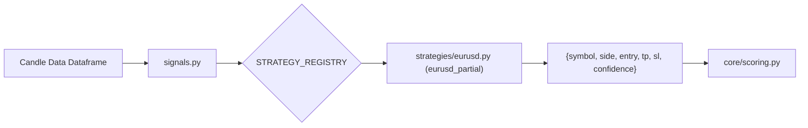

# Strategy Ecosystem & Development Guide — LastEdge

> **Authoritative Single Source of Truth for Strategy Authoring, Registration, and Lifecycle Management**

---

## 1. Strategy Engine Architecture

Strategies in LastEdge are encapsulated Python modules extending `BaseStrategy` (`strategies/base.py`). 

The Strategy Engine is decoupled from execution and risk management:
- **Strategy Code (`strategies/`):** Evaluates price action and returns pure signal dictionaries.
- **Dispatcher (`signals.py`):** Holds `STRATEGY_REGISTRY`, dynamically instantiates strategy objects, and resets stateful strategy instances between backtest sessions via `reset_strategy_instances()`.
- **Core Engine (`core/engine.py`):** Receives signals from the dispatcher, scores confidence, and passes them to Risk Engine v2.



---

## 2. The Strategy Interface (`strategies/base.py`)

Every strategy must inherit from `BaseStrategy` and implement the following contract:

```python
from abc import ABC, abstractmethod
from typing import Dict, List, Optional, Any
import pandas as pd

class BaseStrategy(ABC):
    
    @property
    @abstractmethod
    def metadata(self) -> Dict[str, Any]:
        """
        Must return strategy metadata dictionary:
        {
            "id": "eurusd_partial",
            "name": "EURUSD Partial Close Strategy",
            "symbol": "EURUSD",
            "required_history": 10000,
            "required_timeframe": "H1"
        }
        """
        pass

    @abstractmethod
    def generate_signals(self, candles: pd.DataFrame, state: Optional[Dict] = None) -> List[Dict[str, Any]]:
        """
        Evaluates candle DataFrame and returns a list of signal dicts.
        Each signal dict contains:
        {
            "symbol": "EURUSD",
            "side": "BUY" | "SELL",
            "entry": float,
            "sl": float,
            "tp": float,
            "confidence": "HIGH" | "MEDIUM" | "LOW",
            "score": float (0-100),
            "reason": str
        }
        """
        pass

    def reset_state(self) -> None:
        """Optional: resets internal indicators or daily trade counters."""
        pass
```

---

## 3. Active Production Strategies (v1.1)

| Strategy ID | Class & File | Symbol | Entry Logic Summary | Exit Management & Latching |
|---|---|---|---|---|
| `eurusd_partial` | `EURUSDPartialStrategy`<br>(`strategies/eurusd.py`) | EURUSD | H1 Trend pullback + momentum filter | **50% Partial Close @ 2.0× ATR profit**; remaining 50% lot trails SL @ 1.5× ATR distance; max target @ 5.0× ATR |
| `xauusd_partial` | `XAUUSDPartialStrategy`<br>(`strategies/xauusd.py`) | XAUUSD | H1 Trend breakout + volatility filter | **50% Partial Close @ 2.0× ATR profit**; remaining 50% lot trails SL @ 2.0× ATR distance |
| `btceur_partial` | `BTCEURPartialStrategy`<br>(`strategies/btceur_new.py`) | BTCEUR | H1 EMA cross + ATR range breakout | **50% Partial Close @ 2.0× ATR profit**; remaining 50% lot trails SL @ 2.0× ATR distance |

---

## 4. Reference & Legacy Strategies

| Strategy ID | Symbol | Historical Context & Operational Status |
|---|---|---|
| `eurusd_simple` | EURUSD | Original v1.0 baseline strategy. SL @ 1.5× ATR, TP @ 6.0× ATR (1:4 RR). Superseded by `eurusd_partial`. |
| `xauusd_momentum` | XAUUSD | High winrate momentum model, but low trade frequency (78 trades / 20k bars). Retained as reference. |
| `btc_trend_pullback_v1` | BTCEUR | Trend pullback strategy. Triggered Circuit Breaker pause on 53% of test windows. |
| `btceur_weekly_breakout` | BTCEUR | Weekly breakout model. Maintained for long-horizon comparative studies. |
| `btceur_regime_momentum` | BTCEUR | Multi-timeframe H4 + Daily regime strategy. Supported via dynamic `required_timeframe` detection in `replay_engine.py`. |

---

## 5. Discarded Experimental Strategies (`strategies/experimental/`)

Strategies that fail Phase 3 Progressive Retest or Phase 4 Walk-Forward validation are quarantined in `strategies/experimental/`. They are excluded from production scans but preserved for research auditing:

```
strategies/experimental/
├── README.md                   # Rejection audit summary
├── eurusd_asian_breakout.py    # Asian session breakout (PF < 1.0 at 10k/15k/20k horizons)
├── eurusd_mtf.py               # Multi-timeframe trend (PF 0.46 with transaction costs)
└── xauusd_psychological.py     # Round-number psychological level bounce (Negative PF)
```

---

## 6. How to Implement and Deploy a New Strategy

Follow these step-by-step instructions to create, test, register, and activate a new strategy:

### Step 1: Create Strategy File
Create a new file in `strategies/my_new_strategy.py` subclassing `BaseStrategy`:

```python
from strategies.base import BaseStrategy

class MyNewStrategy(BaseStrategy):
    @property
    def metadata(self):
        return {
            "id": "my_new_strategy",
            "name": "My New Strategy",
            "symbol": "EURUSD",
            "required_history": 10000,
            "required_timeframe": "H1"
        }

    def generate_signals(self, candles, state=None):
        # Implementation of deterministic signal generation
        return []
```

### Step 2: Register in `signals.py`
Add the strategy factory function to `STRATEGY_REGISTRY` in `signals.py`:

```python
STRATEGY_REGISTRY = {
    ...
    'my_new_strategy': lambda: _get_my_new_strategy(),
}

def _get_my_new_strategy():
    from strategies.my_new_strategy import MyNewStrategy
    return MyNewStrategy()
```

### Step 3: Run Backtest & Progressive Retest
Evaluate the strategy across 10k, 15k, and 20k candles:

```bash
python tests/backtest_runner.py --symbol EURUSD --strategy my_new_strategy --bars 20000 --save
```

### Step 4: Run Exit Research & Validation
If progressive retest yields a **ROBUST** or **STABLE** classification, run Exit Research:

```bash
python run_exit_research.py --bars 20000
```

### Step 5: Activate in `rules_config.json`
Update `rules_config.json` to assign the strategy to production live monitoring:

```json
{
  "EURUSD": {
    "strategy": "my_new_strategy",
    "active": true
  }
}
```
