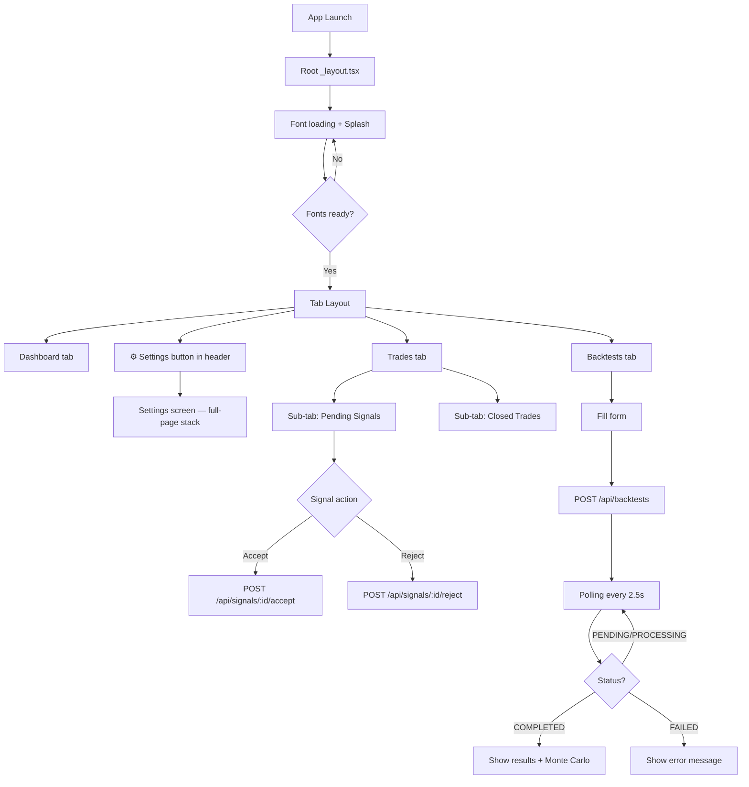
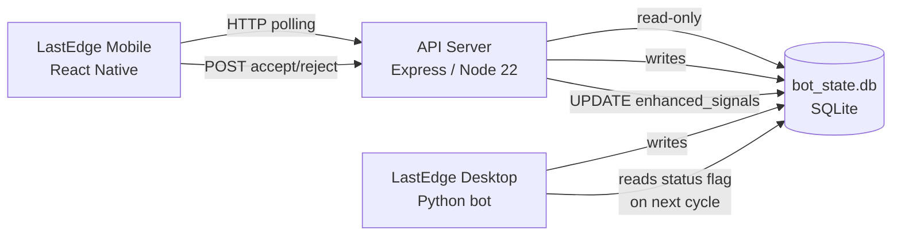

<div align="center">

# LastEdge Mobile

**Remote monitoring and backtest execution for the LastEdge trading system**


</div>

---

## 1. Introduction

LastEdge Mobile is a React Native application (Expo SDK 54) that provides remote access to the LastEdge trading bot running on a Windows desktop machine.

**What it is:** A monitoring and research tool. Not a trading terminal.

**What it does:**
- Shows real-time equity, balance, margin, and MT5 connection status
- Displays active signals and lets you accept or reject them remotely
- Shows the history of closed trades with P&L breakdown
- Lets you launch backtests remotely and read results including Monte Carlo analysis
- Configures connection parameters (server URL, API token, polling interval)

**How it relates to LastEdge Desktop:**  
The mobile app does not connect to MT5 directly. It connects to a small Express/Node.js API server (`api-server`) that reads from `bot_state.db` — the same SQLite database written by the Python bot. This means the mobile app always reflects what the bot is actually doing, with zero latency coupling.

**What problem it solves:**  
Allows monitoring and limited control of the trading system from anywhere on the local network (or remotely if the server is exposed), without needing to be at the desktop running MT5.

---

## 2. Philosophy

> **Observe. Don't intervene.**

The mobile app is designed around the same philosophy as LastEdge itself: collect evidence before acting.

| Question | Answer |
|---|---|
| Is it designed to operate (place orders)? | **No.** Signal accept/reject writes a flag to the DB that the Python bot reads on its next cycle. The bot decides whether to execute. |
| Is it designed to monitor? | **Yes.** Real-time equity, positions, and P&L are the primary use case. |
| Is it designed to research? | **Partially.** The Backtests screen allows launching research backtests remotely. The results include Monte Carlo analysis. |
| What is its role in the LastEdge ecosystem? | It is a read-heavy satellite. It consumes data from the bot and provides a mobile-friendly view of what is happening. |

The app is intentionally minimal. No charting library. No order management. No strategy editor. The desktop dashboard (`localhost:8080`) handles the heavy UI work; the mobile app handles portability.

---

## 3. Current Features

### Dashboard
- Real-time equity and balance display (EUR, 2 decimal places)
- Equity curve chart (last 48 snapshots from `balance_snapshots` table)
- Daily P&L (last 24h of closed trades)
- Overall winrate (all closed trades in memory)
- Open positions count
- Pending signals count with "requires action" indicator
- MT5 account details: margin used, free margin, margin level
- MT5 connection badge with animated pulse dot and uptime
- Pull-to-refresh

### Trades — Pending tab
- List of all signals with status `pending` or `active`
- `SignalCard` with: symbol, direction (BUY/SELL), entry/TP/SL/RR/lot
- Accept and Reject buttons with haptic feedback (pending signals only)
- Visual differentiation: pending signals show amber border + "REQUIRES ACTION" badge
- Active signals show green "ORDEN ACTIVA" bar
- Rejected signals show red "RECHAZADA" bar
- Timestamps with relative time ("3m ago")

### Trades — Closed tab
- List of closed trades from `session_trades` table
- `TradeCard` with: symbol, type, open/close prices, pips, P&L in EUR, close reason
- Close reason badge: TAKE PROFIT / STOP LOSS / MANUAL
- Summary bar: total P&L, wins, losses, profit factor
- Pull-to-refresh

### Backtests
- Launch backtests on the remote bot by queuing tasks via POST `/api/backtests`
- Form inputs: symbol (EURUSD/XAUUSD/BTCEUR), strategy (per-symbol list), timeframe (M5/M15/H1/H4/D1), number of bars, circuit breaker mode (off/standard/aggressive)
- Strategy-specific timeframe locking (e.g. `btceur_regime_momentum` only allows H4)
- Auto-polling every 2.5s while a task is PENDING or PROCESSING
- Results display: winrate, profit factor, net pips, signal count
- Monte Carlo block (when `mc.status === "success"`):
  - Verdict card: low/moderate/high risk with color coding
  - Profit probability and ruin risk percentages
  - Expected drawdown (p50) and worst-case drawdown (p95)
  - Worst equity (p5) and median equity (p50)
  - Expandable interpretation guide (collapsible)
- Recent history: last 10 backtest tasks with status badges, tap to reload any

### Settings
- **Server section:** custom URL and API token inputs with save button; MT5 status, effective URL, token (masked), last sync time; test connection button (returns latency + MT5 state); manual refresh button
- **Auto-update section:** toggle auto-refresh on/off; polling interval selector (3s / 5s / 10s / 30s)
- **Notifications section:** master toggle; per-category toggles (new signals, trade close, MT5 disconnect); request permissions button; test notification button; clear badge button
- **Interface section:** language selector (English 🇬🇧 / Spanish 🇪🇸); haptic feedback toggle
- **Data section:** clear notification badge; reset all settings to defaults
- **About section:** app version, Expo SDK version, platform info, data mode (mock vs live)

### System
- Global `ApiErrorBanner` shown on every screen when server is unreachable or mock data is active
- Mock data fallback in development mode (`__DEV__ === true`) when API is unreachable
- `ErrorBoundary` wrapping the entire app with `ErrorFallback` (restart button + stack trace modal in dev)
- Settings persisted to `AsyncStorage` under key `@bot_mt5_settings_v2` (with migration from v1)
- Push notifications: local notifications for new signals, trade closes, and MT5 disconnection events
  - Android notification channels: `critical`, `signals`, `trades`
  - Tap-to-navigate: signal notifications → Trades tab, critical errors → Dashboard

---

## 4. Architecture

```
mobile-app/
└── Pasted-Rol-Objective/
    ├── artifacts/
    │   ├── mobile/              ← React Native / Expo app
    │   └── api-server/          ← Express bridge to bot_state.db
    ├── package.json             ← pnpm workspace root
    └── pnpm-workspace.yaml
```

### Mobile app structure (`artifacts/mobile/`)

```
app/
├── _layout.tsx              Root layout — providers, fonts, notification setup
└── (tabs)/
    ├── _layout.tsx          Tab bar + settings button in header
    ├── index.tsx            Dashboard screen
    ├── trades.tsx           Trades screen (pending + closed sub-tabs)
    ├── backtests.tsx        Backtests screen
    └── settings.tsx         Settings screen (not in tab bar, accessible via header)

context/
├── TradingContext.tsx       Global trading state — polling, signals, trades, equity
└── SettingsContext.tsx      Persistent settings — AsyncStorage, API overrides

services/
├── backtestApi.ts           API client for backtest task queue
├── connectionTest.ts        healthz + status connection tester
└── notifications.ts         expo-notifications setup, local/push, channels

components/
├── SignalCard.tsx            Signal display with accept/reject actions
├── TradeCard.tsx             Closed trade display
├── StatsCard.tsx             KPI card (icon + value + trend)
├── EquityChart.tsx           Equity curve (custom, no chart library)
├── ConnectionBadge.tsx       Animated MT5 connection indicator
├── ApiErrorBanner.tsx        Error/mock data banner
├── ErrorBoundary.tsx         React class error boundary
├── ErrorFallback.tsx         Crash screen with dev stack trace modal
├── KeyboardAwareScrollViewCompat.tsx  Platform wrapper
└── settings/
    ├── SettingsSection.tsx   Grouped card container
    ├── SettingsRow.tsx       Label + value/chevron row
    └── SettingsToggle.tsx    Label + Switch row

constants/
├── colors.ts                Design tokens (single dark palette)
└── backtest.ts              Symbol/strategy/CB constants for the Backtests form

lib/
└── apiConfig.ts             URL/token resolution (build env → overrides)

hooks/
├── useColors.ts             Returns active palette (light/dark system)
└── useTranslation.ts        Returns t() function from SettingsContext.language

i18n/
└── translations.ts          Full EN + ES strings (~120 keys each)

__mocks__/
└── tradingData.ts           Mock status/signals/trades/equity for dev offline mode
```

### API server structure (`artifacts/api-server/`)

```
src/
├── app.ts                   Express setup — CORS, pino-http, body parsing, routes
├── index.ts                 Server entry — PORT validation, listen
├── routes/
│   ├── index.ts             Router — healthz (public), /status (public), rest (auth)
│   ├── health.ts            GET /healthz → {status: "ok"}
│   └── bot.ts               All bot endpoints
└── lib/
    ├── db.ts                SQLite via node:sqlite (Node 22), ensureSchema
    ├── auth.ts              Bearer token middleware (dev bypass / prod block)
    └── logger.ts            Pino with pino-pretty in dev, redact headers
```

---

## 5. Navigation Flow



**Tab bar:** Dashboard · Trades · Backtests  
**Settings:** accessible via the gear icon in the header of every screen (not a tab item — `href: null` in the layout)  
**Back navigation:** Expo Router Stack handles the settings screen as a stack push over the tab layout  
**No modals, drawers, or deep links** are implemented beyond notification tap-to-navigate

---

## 6. Communication with LastEdge



### Polling mechanism

`TradingContext` fires `fetchAllData()` on mount and then on a configurable interval (default 5s, configurable 3/5/10/30s). Each cycle fires 4 sequential fetches:

| Fetch | Endpoint | Purpose |
|---|---|---|
| 1 | `GET /api/status` | Bot connection, equity, balance, margin, uptime |
| 2 | `GET /api/signals` | Pending + active signals from `enhanced_signals` |
| 3 | `GET /api/trades` | Closed trades from `session_trades` |
| 4 | `GET /api/equityHistory` | Last 48 equity snapshots |

All fetches are sequential (not parallel) to avoid flooding the SQLite reader.

### Authentication

Every request except `/api/healthz` and `/api/status` requires a `Bearer <token>` header. The token is set via `API_SECRET` environment variable on the server. The mobile app sends it as `Authorization: Bearer <token>` + `X-Api-Key: <token>` (dual header for compatibility). In development, if `API_SECRET` is not set, auth is bypassed.

### Signal accept/reject

When the user accepts a signal, the app sends `POST /api/signals/:id/accept`. The server updates `enhanced_signals.status = 'ACCEPTED'` in the DB. The Python bot reads this flag on its next 20s polling cycle and decides whether to execute the trade in MT5. The mobile app does NOT directly place MT5 orders.

### Backtest queue

The app writes a row to `backtest_tasks` via `POST /api/backtests`. The Python bot has a queue processor that reads `PENDING` tasks from this table, runs the backtest, and writes `results_json` back. The app polls `GET /api/backtests/:id` every 2.5s until the status is `COMPLETED` or `FAILED`.

---

## 7. Design

### Color palette

The app uses a **single dark theme**. The `colors.ts` file defines both `light` and `dark` keys with identical values — there is effectively no light mode.

| Token | Value | Semantic use |
|---|---|---|
| `background` | `#09090b` | Screen background |
| `card` | `#18181b` | Card surfaces |
| `secondary` | `#27272a` | Input backgrounds, chip backgrounds |
| `border` | `#27272a` | Dividers and borders |
| `primary` | `#4ade80` | Green — active state, buttons, accent |
| `primaryForeground` | `#09090b` | Text on primary |
| `foreground` | `#fafafa` | Primary text |
| `mutedForeground` | `#a1a1aa` | Secondary text, labels |
| `profit` / `buy` | `#4ade80` | Gains, buy signals |
| `loss` / `sell` | `#f87171` | Losses, sell signals |
| `pending` | `#fbbf24` | Amber — pending signals, warnings |
| `destructive` | `#f87171` | Destructive actions |
| `connected` | `#4ade80` | MT5 connected state |
| `disconnected` | `#f87171` | MT5 disconnected state |

`colors.radius = 12` — default border radius

### Typography

Inter font family via `@expo-google-fonts/inter`. Four weights loaded:

| Weight | Variable | Typical use |
|---|---|---|
| 400 | `Inter_400Regular` | Body text, descriptions |
| 500 | `Inter_500Medium` | Labels, secondary info |
| 600 | `Inter_600SemiBold` | Card titles, section headers |
| 700 | `Inter_700Bold` | Values, headings, KPIs |

`fontVariant: ["tabular-nums"]` applied to all numeric values for alignment.

### Icons

`@expo/vector-icons` — Feather icon set exclusively. No other icon library.

### Components

| Component | Reuse | Props |
|---|---|---|
| `StatsCard` | Dashboard KPI grid | label, value, subValue, icon, trend, accent |
| `SignalCard` | Trades > Pending | signal, onAccept?, onReject? |
| `TradeCard` | Trades > Closed | trade |
| `EquityChart` | Dashboard | data, height, showLabels |
| `ConnectionBadge` | Dashboard header | connected, uptime |
| `ApiErrorBanner` | All screens | (no props — reads TradingContext) |
| `SettingsSection` | Settings | title, children |
| `SettingsRow` | Settings | icon, label, value, onPress, destructive, loading |
| `SettingsToggle` | Settings | icon, label, description, value, onValueChange |

There is no formal design system or Storybook. Components are self-contained with inline `StyleSheet`.

---

## 8. Current State

| Module | Screen | Status | Notes |
|---|---|---|---|
| Dashboard | `index.tsx` | ✅ Complete | Equity, chart, stats, account, connection badge |
| Equity Chart | `EquityChart.tsx` | ✅ Complete | Custom SVG-less impl with View segments |
| Pending Signals | `trades.tsx` | ✅ Complete | Accept/reject with haptics |
| Closed Trades | `trades.tsx` | ✅ Complete | P&L summary + per-trade cards |
| Backtest form | `backtests.tsx` | ✅ Complete | Symbol, strategy, TF, bars, CB mode |
| Backtest results | `backtests.tsx` | ✅ Complete | Metrics grid + Monte Carlo block |
| Backtest history | `backtests.tsx` | ✅ Complete | Last 10 tasks, tap to reload |
| Monte Carlo | `backtests.tsx` | ✅ Complete | Verdict card + drawdown + equity percentiles |
| Server config | `settings.tsx` | ✅ Complete | URL/token input, save, test, status |
| Auto-refresh | `settings.tsx` | ✅ Complete | Toggle + interval selector |
| Notifications | `settings.tsx` | ✅ Complete | Per-category toggles, test, permissions |
| Language (i18n) | `settings.tsx` | ✅ Complete | EN / ES full coverage |
| Haptics | `settings.tsx` | ✅ Complete | Accept/reject/test haptic feedback |
| Mock data fallback | `TradingContext` | ✅ Complete | Dev mode only, amber banner shown |
| Error boundary | `_layout.tsx` | ✅ Complete | Restart button + dev stack trace modal |
| Push notifications | `notifications.ts` | ✅ Implemented | Local only confirmed; Expo push token requires EAS projectId |
| Dark mode | `colors.ts` | ⚠️ Partial | Tokens defined but light=dark (no real light theme) |
| iPad / tablet | layout | ⚠️ Untested | No responsive breakpoints for large screens |
| iOS | native | ⚠️ Not built | Only Android APK has been built and tested |
| Signal execution view | — | ❌ Not implemented | No confirmation dialog before accept |
| Live P&L on open trades | — | ❌ Not implemented | Floating P&L not fetched |
| Strategy analytics | — | ❌ Not implemented | No per-strategy stats view |
| Alerts / notifications list | — | ❌ Not implemented | No in-app notification center |
| eurusd_partial in backtest form | `backtest.ts` | ❌ Outdated | Strategy list hardcoded, does not include new v1.1 strategies |

---

## 9. Main Dependencies

### Mobile app

| Package | Version | Purpose |
|---|---|---|
| `expo` | ~54.0.35 | Base Expo SDK and CLI |
| `expo-router` | ~6.0.17 | File-based routing (Stack + Tabs) |
| `react-native` | 0.81.5 | Core mobile framework |
| `react` | 19.1.0 | UI library |
| `@expo-google-fonts/inter` | ^0.4.0 | Inter font family (400/500/600/700) |
| `@expo/vector-icons` | ^15.0.3 | Feather icon set |
| `@react-native-async-storage/async-storage` | 2.2.0 | Settings persistence |
| `@tanstack/react-query` | ^5.90.21 | Installed but not yet used in production flows |
| `expo-notifications` | ^0.32.17 | Local + push notifications |
| `expo-haptics` | ~15.0.8 | Haptic feedback on accept/reject |
| `expo-blur` | ~15.0.8 | iOS tab bar blur effect |
| `expo-constants` | ~18.0.11 | App version, EAS config, env vars |
| `expo-splash-screen` | ~31.0.12 | Splash screen management |
| `react-native-safe-area-context` | ~5.6.0 | Safe area insets |
| `react-native-screens` | ~4.16.0 | Native screen transitions |
| `react-native-gesture-handler` | ~2.28.0 | Gesture support |
| `react-native-keyboard-controller` | 1.18.5 | Keyboard-aware scroll (used only in compat wrapper) |
| `react-native-reanimated` | ~4.1.1 | Installed, not actively used in current screens |
| `react-native-svg` | 15.12.1 | Installed, not used (chart is custom View-based) |
| `zod` | ^3.25.76 | Installed, not yet used |
| `expo-glass-effect` | ~0.1.4 | Installed, not used |
| `expo-image` | ~3.0.11 | Installed, not used |

### API server

| Package | Version | Purpose |
|---|---|---|
| `express` | ^5.2.1 | HTTP server |
| `cors` | ^2.8.6 | CORS middleware |
| `pino` | ^9.14.0 | Structured JSON logger |
| `pino-http` | ^10.5.0 | HTTP request logging |
| `pino-pretty` | ^13.1.3 | Dev log formatting |
| `esbuild` | 0.27.3 | TypeScript bundler |
| `node:sqlite` | built-in (Node 22) | SQLite reader — **requires Node 22+** |

---

## 10. Screenshots

> No screenshots are currently included in the repository.

The expected screens to capture for documentation:

| Screen | What to show |
|---|---|
| Dashboard | MT5 connected badge + equity card + chart + 4 KPI cards |
| Trades / Pending | At least one `SignalCard` with pending state |
| Trades / Closed | Summary bar + 2-3 TradeCards |
| Backtests form | Symbol/strategy/CB selectors |
| Backtests result | Completed result with Monte Carlo verdict card |
| Settings | Server section + test result |
| ApiErrorBanner | Red banner visible on any screen |
| ErrorFallback | Dev mode stack trace modal |

---

## 11. Roadmap

Features that are partially implemented or planned based on the current codebase:

- **`eurusd_partial` in backtest form** — `constants/backtest.ts` and `routes/bot.ts#/strategies` both list `eurusd_simple` as the default EURUSD strategy. Neither has been updated to reflect the v1.1 active strategy. This is the most immediate gap.
- **TanStack Query migration** — `@tanstack/react-query` is installed and `QueryClient` is initialized in `_layout.tsx`, but `TradingContext` still uses manual `setInterval` + `fetch`. A migration to `useQuery` would simplify polling logic significantly.
- **Light theme** — `colors.ts` defines both `light` and `dark` keys with identical values. The infra (`useColors` reads `useColorScheme()`) is ready; only the palette tokens need to differ.
- **Live floating P&L** — `BotStatus` includes `equity` but there is no per-trade floating P&L. Would require an additional endpoint or augmented `/api/signals`.
- **Confirmation dialog before accept** — `SignalCard` calls `onAccept` immediately on tap. A confirmation step would prevent accidental order acceptance.
- **Strategy analytics view** — The data is available in `session_trades` and `trade_journal` but there is no per-strategy breakdown screen in the app.
- **Zod validation** — `zod` is installed but not used. API responses are cast with `as T` in `TradingContext`. Adding validation would catch schema drift.

---

## 12. Project State

| Dimension | Status |
|---|---|
| Functionality | Functional MVP — all core monitoring features work end-to-end |
| Stability | Stable for personal use on Android; not production-hardened |
| iOS support | Not built or tested |
| Test coverage | None — no test files exist in the mobile app |
| Build system | Android APK via Gradle (`assembleRelease`) or EAS local build |
| Node requirement | **Node 22+** required by the API server (`node:sqlite` built-in) |
| API server | Must run on the same machine as the Python bot (shares `bot_state.db`) |

**What is missing for a stable v1.0 release:**
1. Update strategy list in `constants/backtest.ts` and `routes/bot.ts` to include `eurusd_partial`
2. At least smoke tests for the API server endpoints
3. A real light color palette or explicit dark-only declaration
4. iOS build verification
5. Confirmation dialog on signal accept

---

## 13. Current Limitations

| Limitation | Detail |
|---|---|
| No direct MT5 connection | The app talks to the API server, which talks to the DB. The bot must be running for data to be current. |
| No real-time push | Data updates via polling only. There is no WebSocket or server-sent events. Minimum latency = poll interval (default 5s). |
| API server not exposed remotely by default | Requires manual port forwarding or VPN for access outside the local network. |
| `bot_state.db` schema dependency | The app reads tables (`session_trades`, `enhanced_signals`, `balance_snapshots`, `session_stats`) that must exist and be populated by the Python bot. If the bot has never run, all data will be empty. |
| Signal accept ≠ immediate execution | Accepting a signal writes a DB flag. The Python bot reads it on its next ~20s cycle. There is no acknowledgment back to the app. |
| Monte Carlo says "5,000 simulations" | The translation string says "Monte Carlo · 5,000 simulations" but the actual Python backend runs 2,000. The string is incorrect. |
| Strategy list is hardcoded | `routes/bot.ts#/strategies` returns a static array. Adding `eurusd_partial` requires a manual code change in the API server. |
| `eurusd_asian_breakout` is the default strategy | `constants/backtest.ts` sets `DEFAULT_STRATEGY.EURUSD = "eurusd_asian_breakout"`, which is a discarded strategy. This is a stale default. |
| No offline caching | If the API is unreachable, previous data is lost on refresh (except for mock data in dev mode). |
| `react-native-svg` installed but unused | The equity chart uses a custom `View`-based rendering instead of SVG. The dependency adds bundle size without benefit. |

---

## 14. Design Decisions

**Why a separate API server instead of connecting directly to MT5 or the Python bot?**  
The Python bot writes to `bot_state.db` but does not expose an HTTP API. Rather than modifying the bot, a thin Express bridge was added that reads the same DB. This keeps the bot architecture unchanged and the mobile app loosely coupled.

**Why `node:sqlite` instead of `better-sqlite3`?**  
Node 22 ships SQLite as a built-in module with a synchronous API. This eliminates a native dependency that would require compilation per platform. The tradeoff is a hard Node 22+ requirement.

**Why polling instead of WebSockets?**  
Polling at 5s intervals is sufficient for the monitoring use case. WebSockets would require changes to both the Python bot and the API server. The complexity is not justified for a single-user tool.

**Why no chart library (react-native-svg, Victory, recharts)?**  
The equity chart uses custom `View` segments to avoid adding a large dependency for a single use. `react-native-svg` is installed but unused — this decision should be revisited if more charts are needed.

**Why file-based routing (Expo Router) instead of React Navigation directly?**  
Expo Router provides a simpler developer experience for a small app with a predictable screen structure. The tab + stack combination maps naturally to the app's navigation needs.

**Why `TradingProvider` as a single global context?**  
All screens need the same data (status, signals, trades). A single provider avoids prop drilling and redundant fetches. The tradeoff is that a polling error anywhere affects all screens.

**Why `AsyncStorage` at key `@bot_mt5_settings_v2`?**  
The `_v2` suffix indicates a schema migration from `v1` (which lacked `language` and `serverToken`). The `SettingsProvider` reads both keys and merges, so users upgrading from v1 don't lose their settings. The old name (`@bot_mt5_settings`) reflects the pre-rebranding project name.

---

## 15. Developer Observations

Items that should be addressed before the next development phase, in priority order:

### Critical
1. **`constants/backtest.ts` — stale strategy list:** `eurusd_asian_breakout` is set as `DEFAULT_STRATEGY.EURUSD` and listed first in `STRATEGIES_BY_SYMBOL.EURUSD`. This is a discarded strategy. The default should be `eurusd_partial` and the list should reflect the current active + reference strategies.

2. **`routes/bot.ts#/strategies` — hardcoded and outdated:** The strategy list in the API server includes `eurusd_simple`, `eurusd_mtf`, `eurusd_asian_breakout` but not `eurusd_partial`. Any backtest launched from the mobile app for EURUSD will use the wrong strategy set. This needs to be updated whenever strategies change in `signals.py`.

3. **`translations.ts` — Monte Carlo count mismatch:** `monteCarloSimulations` says "5,000 simulations" in both EN and ES. The Python backend (`core/exit_research/runner.py`) runs 2,000 simulations. Either the translation or the backend count needs alignment.

### High priority
4. **`@tanstack/react-query` installed but unused:** `QueryClient` is initialized in `_layout.tsx` but `TradingContext` uses manual `setInterval`. The package adds ~50KB to the bundle for no benefit. Either migrate to `useQuery` or remove the dependency.

5. **`react-native-svg` installed but unused:** ~300KB native dependency. Remove if no SVG charts are planned, or migrate `EquityChart` to use it.

6. **`expo-glass-effect`, `expo-image`, `react-native-worklets` installed but unused:** Dead dependencies increasing bundle size.

7. **No confirmation dialog on signal accept:** Tapping "ACEPTAR" in `SignalCard` immediately fires the API call. For a tool that influences trading decisions, at minimum an `Alert.alert` confirmation step should exist.

### Medium priority
8. **Light theme tokens are identical to dark:** `colors.ts` defines `light` and `dark` with the same values. Either implement a real light palette or remove the `light` key and document the app as dark-only.

9. **`SettingsScreen` footer says `t("mockData")`:** The footer text renders `{t("tradingBotMonitor")} · {t("mockData")}` regardless of actual data mode. This looks like a copy-paste error — it should probably show the app version or a copyright line.

10. **`AsyncStorage` key still uses `@bot_mt5_settings_v2`:** Post-rebranding, this key should ideally be `@lastedge_settings_v2`. A migration would be needed to avoid resetting user settings.

11. **`pips` calculation in `routes/bot.ts#/trades` is symbol-agnostic:** The trade pips are calculated as `(closePrice - openPrice)` without accounting for pip size per symbol. For EURUSD this is wrong (needs ×10000), for XAUUSD it's different, for BTCEUR it's different again.

12. **`zod` installed but not used for API response validation:** API responses are cast with `as T` which silently swallows schema changes from the server. Adding Zod schemas would catch mismatches early.

### Low priority
13. **No test coverage:** Neither the mobile app nor the API server has any test files. Unit tests for `apiConfig.ts`, `connectionTest.ts`, and the Express routes would catch regressions quickly.

14. **`TradeCard` formats dates in `es-ES` locale hardcoded:** `formatDate()` in `TradeCard.tsx` uses `d.toLocaleDateString("es-ES", ...)`. This should respect the app language setting.

15. **`SignalCard` precision logic uses string includes:** `signal.symbol.includes("JPY") || signal.symbol.includes("XAU")` to pick decimal places. This is fragile — a proper pip size lookup from a constants map would be cleaner.

---

## Installation and Running

### Requirements
- Node.js **22+** (API server uses `node:sqlite` built-in)
- pnpm 9+
- Expo CLI
- Android device or emulator (iOS not tested)
- LastEdge Python bot running and writing to `bot_state.db`

### API server

```bash
cd artifacts/api-server
cp .env.example .env
# Edit .env: set PORT, API_SECRET, BOT_DB_PATH
pnpm run build
pnpm run start
```

`.env` required fields:
```env
PORT=5000
API_SECRET=your_secret_token
BOT_DB_PATH=C:/BOT-MT5/bot_state.db
NODE_ENV=development
```

### Mobile app (development)

```bash
cd artifacts/mobile
cp .env.example .env
# Edit .env: set EXPO_PUBLIC_API_URL and EXPO_PUBLIC_API_SECRET
pnpm install
pnpm run start
# Scan QR with Expo Go or run on connected device
```

### Build APK

```bash
cd artifacts/mobile
pnpm run build:apk:release
# Output: android/app/build/outputs/apk/release/app-release.apk
```

---

<div align="center">
<sub>LastEdge Mobile — monitoring companion for the LastEdge trading research framework</sub>
</div>
